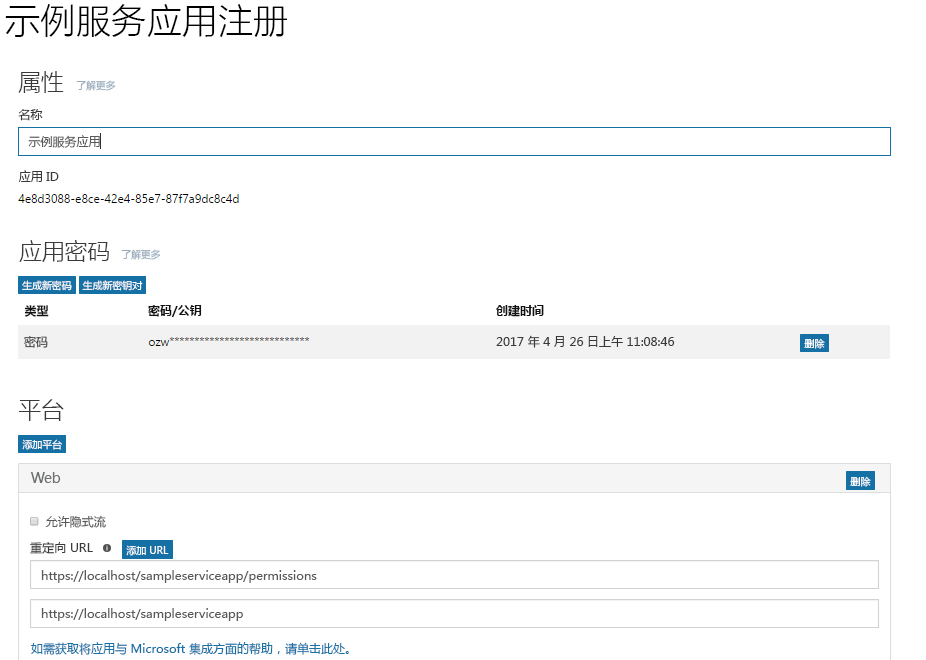
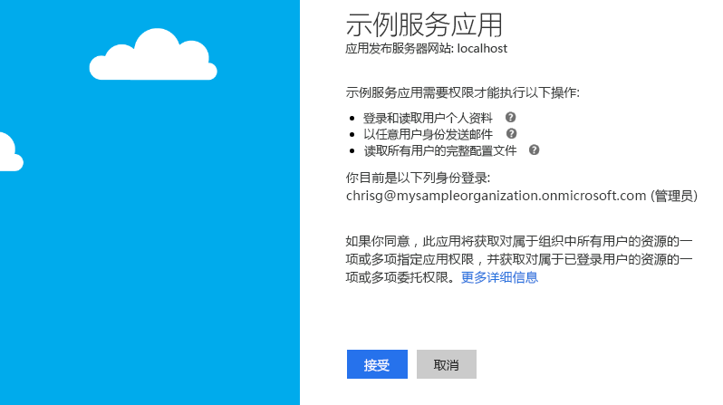

# <a name="get-access-without-a-user"></a>无用户访问
一些应用使用他们自己的标识（而不代表用户）调用 Microsoft Graph。在许多情况下，这些是在的服务器上运行的后台服务或守护程序，不存在登录用户。此类应用的一个示例是电子邮件存档服务，它可以在夜间保持清醒状态并运行。在某些情况下，具有登录用户的应用可能还需要以他们自己的标识调用 Microsoft Graph。例如，应用可能需要使用以下特定功能，该功能要求在组织中具有比登录用户的提升权限更多的权限。  

使用它们自己的标识调用 Microsoft Graph 的应用使用 OAuth 2.0 客户端凭据授予流从 Azure AD 获取访问令牌。在本主题中，我们将展示配置服务和使用 OAuth 客户端凭据授予流获取访问令牌的基本步骤。 

## <a name="authentication-and-authorization-steps"></a>身份验证和授权步骤
配置服务和从 Azure AD v2.0 终结点获取令牌（服务可用于以自己的标识调用 Microsoft Graph）所需的基本步骤如下：

1. 注册应用。
2. 在应用上配置 Microsoft Graph 的权限。
3. 获取管理员同意。
4. 获取访问令牌。
5. 使用访问令牌调用 Microsoft Graph。

## <a name="1-register-your-app"></a>1.注册你的应用程序
若要使用 Azure v2.0 终结点进行身份验证，必须先在 [Microsoft 应用注册门户](https://apps.dev.microsoft.com/)注册你的应用。你可以使用 Microsoft 帐户或工作或学校帐户注册应用。 

下面的屏幕快照显示了已针对后台服务进行配置的 Web 应用注册。

对于将以自己的标识调用 Microsoft Graph 的服务，用户需要将应用注册到 Web 平台并复制以下值：

- 应用注册门户分配的应用程序 ID。
- 应用程序密码，可以是密码，也可以是公钥/私钥对（证书）。
- 可以让服务接收来自 Azure AD 的令牌响应的重定向 URL。
- 你的应用实现功能以请求管理员同意时，可以让服务接收管理员同意响应的重定向 URL。  

有关如何使用 Microsoft 应用注册门户配置应用的步骤，请参阅[注册你的应用](./auth_register_app_v2.md)。

通过 OAuth 2.0 客户端凭据授予流，应用可以使用由 Azure AD 分配的应用程序 ID 和使用门户创建的应用程序密码，直接在 Azure AD v2.0 `/token` 终结点中进行身份验证。 

## <a name="2-configure-permissions-for-microsoft-graph"></a>2.配置 Microsoft Graph 的权限
对于以它们自己的标识调用 Microsoft Graph 的应用，Microsoft Graph 显示应用程序权限。（Microsoft Graph 还显示代表用户调用 Microsoft Graph 的应用的委派权限。）注册应用时，需要预配置应用所需的应用程序权限。应用程序权限始终需要管理员的同意。当你的应用安装在他们的组织中时，管理员可以使用 [Azure 门户](https://portal.azure.com)同意这些权限，你也可以提供应用注册体验，让管理员同意你配置的权限。Azure AD 记录管理员同意后，你的应用无需再次请求同意即可请求令牌。有关可通过 Microsoft Graph 使用的权限的详细信息，请参阅[权限参考](./permissions_reference.md)

若要在 [Microsoft 应用注册门户](https://apps.dev.microsoft.com/)中配置应用的应用程序权限：在“Microsoft Graph”****下，选择“应用程序权限”****旁边的“添加”****，然后在“选择权限”****对话框中选择应用需要的权限。

下面的屏幕快照显示了 Microsoft Graph 应用程序权限的“选择权限”****对话框。 


> **重要说明**：我们建议你配置应用需要的最小特权权限集。这为管理员提供的体验要比不得不同意一个很长的权限列表的体验舒适得多。
>

## <a name="3-get-administrator-consent"></a>3.获取管理员同意
你可以依赖管理员在 [Azure 门户](https://portal.azure.com)中授予应用所需的权限；但是，通常情况下，更好的选择是通过使用 Azure AD v2.0 `/adminconsent` 终结点为管理员提供注册体验。 

### <a name="request"></a>请求
```
// Line breaks are for legibility only.

GET https://login.microsoftonline.com/{tenant}/adminconsent?
client_id=6731de76-14a6-49ae-97bc-6eba6914391e
&state=12345
&redirect_uri=http://localhost/myapp/permissions
```

| 参数 | 条件 | 说明 |
|:----------|:----------|:------------|
| 租户 |必需 |需要从中请求权限的目录租户。它可以 GUID 或友好名称格式显示。如果你不了解用户授予哪个租户，并想让用户使用任意租户登录，请使用 `common`。 |
| client_id |必需 |[应用程序注册门户](https://apps.dev.microsoft.com/)分配给你的应用的应用程序 ID。 |
| redirect_uri |必需 |要向其发送响应供应用处理的重定向 URI。它必须完全匹配在门户中注册的重定向 URI 之一，但它必须采用 URL 编码，且可以拥有其他路径段。 |
| state |建议 |请求中包含的值，也会在令牌响应中返回。它可以是你希望的任何内容的字符串。此状态用于在发生身份验证请求前，对应用中的用户状态信息进行编码（例如它们所在的页面或视图上）。 |

### <a name="administrator-consent-experience"></a>管理员同意体验
对于 `/adminconsent` 终结点的请求，Azure AD 强制规定，仅租户管理员可以登录来完成请求。系统可能会提示管理员批准你在应用注册门户中为应用请求获取的所有应用程序权限。下面的示例展示了 Azure AD 向管理员显示的同意对话框：



### <a name="response"></a>响应
如果管理员批准应用程序的权限，则成功响应如下所示：

```
GET http://localhost/myapp/permissions?tenant=a8990e1f-ff32-408a-9f8e-78d3b9139b95&state=state=12345&admin_consent=True
```

| 参数 | 说明 |
|:----------|:------------|
| 租户 |以 GUID 格式向应用程序授予其请求的权限的目录租户。 |
| state |请求中包含的值，也会在令牌响应中返回。它可以是你希望的任何内容的字符串。此状态用于在发生身份验证请求前，对应用中的用户状态信息进行编码（例如它们所在的页面或视图上）。 |
| admin_consent |设置为 **true**。 |


> **试一试** 你可以通过将下面的请求粘贴到浏览器中自行尝试。如果以 Azure AD 租户的全局管理员身份登录，你将看到应用的管理员同意对话框。（这与上文的同意对话屏幕截图中显示的应用不同。）
> 

```
https://login.microsoftonline.com/common/adminconsent?client_id=6731de76-14a6-49ae-97bc-6eba6914391e&state=12345&redirect_uri=http://localhost/myapp/permissions
```

## <a name="4-get-an-access-token"></a>4.获取访问令牌
在 OAuth 2.0 客户端凭据授予流中，可以在注册应用以便直接从 Azure AD v2.0 `/token` 终结点请求访问令牌时使用应用程序 ID 和应用程序密码值。

你可以通过传递 `https://graph.microsoft.com/.default` 并将其作为令牌请求中 `scope` 参数的值来指定预配置的权限。请参阅下面的令牌请求中的 `scope` 参数说明获取详情。

### <a name="token-request"></a>令牌请求
你可以将 POST 请求发送到 `/token` 2.0 终结点来获取访问令牌：

```
POST /{tenant}/oauth2/v2.0/token HTTP/1.1
Host: login.microsoftonline.com
Content-Type: application/x-www-form-urlencoded

client_id=535fb089-9ff3-47b6-9bfb-4f1264799865&scope=https%3A%2F%2Fgraph.microsoft.com%2F.default&client_secret=qWgdYAmab0YSkuL1qKv5bPX&grant_type=client_credentials
```

| 参数 | 条件 | 说明 |
|:----------|:----------|:------------|
| 租户 |必需 |需要从中请求权限的目录租户。它可以 GUID 或友好名称格式显示。 |
| client_id |必需 |当注册应用时，[Microsoft 应用注册门户](https://apps.dev.microsoft.com)分配的应用程序 ID。 |
| 范围 |必需 |为此请求中的 `scope` 参数传递的值应为所需资源的资源标识符（应用程序 ID URI），带有 `.default` 后缀。对于 Microsoft Graph，值为 `https://graph.microsoft.com/.default`。此值会指示 v2.0 终结点，对于为应用配置的所有应用程序权限，它应该为要使用的资源的关联项颁发令牌。 |
| client_secret |必需 |你在应用注册门户中为应用生成的应用程序密码。 |
| grant_type |必需 |必须是 `client_credentials`。 |

#### <a name="token-response"></a>令牌响应
成功的响应如下所示：

```
{
  "token_type": "Bearer",
  "expires_in": 3599,
  "access_token": "eyJ0eXAiOiJKV1QiLCJhbGciOiJSUzI1NiIsIng1dCI6Ik1uQ19WWmNBVGZNNXBP..."
}
```

| 参数 | 说明 |
|:----------|:------------|
| access_token |请求的访问令牌。应用可使用此令牌调用 Microsoft Graph。 |
| token_type |表示令牌类型值。Azure AD 唯一支持的类型是 `bearer` |
| expires_in |访问令牌的有效期是多久（以秒为单位）。 |

## <a name="5-use-the-access-token-to-call-microsoft-graph"></a>5.使用访问令牌调用 Microsoft Graph

一旦拥有访问令牌，可以通过将其包含在请求的 `Authorization` 标头中，用其调用 Microsoft Graph。以下请求可以获取特定用户的个人资料。你的应用必须拥有 _User.Read.All_ 权限才能调用此 API。

```
GET https://graph.microsoft.com/v1.0/user/12345678-73a6-4952-a53a-e9916737ff7f 
Authorization: Bearer eyJ0eXAiO ... 0X2tnSQLEANnSPHY0gKcgw
Host: graph.microsoft.com

```
成功的响应将与此类似（一些响应标头已被删除）：

```
HTTP/1.1 200 OK
Content-Type: application/json;odata.metadata=minimal;odata.streaming=true;IEEE754Compatible=false;charset=utf-8
request-id: f45d08c0-6901-473a-90f5-7867287de97f
client-request-id: f45d08c0-6901-473a-90f5-7867287de97f
OData-Version: 4.0
Duration: 309.0273
Date: Wed, 26 Apr 2017 19:53:49 GMT
Content-Length: 407

{
    "@odata.context":"https://graph.microsoft.com/v1.0/$metadata#users/$entity",
    "id":"12345678-73a6-4952-a53a-e9916737ff7f",
    "businessPhones":[
        "+1 555555555"
    ],
    "displayName":"Chris Green",
    "givenName":"Chris",
    "jobTitle":"Software Engineer",
    "mail":null,
    "mobilePhone":"+1 5555555555",
    "officeLocation":"Seattle Office",
    "preferredLanguage":null,
    "surname":"Green",
    "userPrincipalName":"ChrisG@contoso.onmicrosoft.com"
}
```

## <a name="supported-app-scenarios-and-resources"></a>受支持的应用场景和资源
以它们自己的标识调用 Microsoft Graph 的应用可分为两个类别：

- 在服务器上运行的没有登录用户的后台服务（守护程序）。
- 具有登录用户但仍以它们自己的标识调用 Microsoft Graph 的应用；例如，使用需要具有比登录用户所拥有的提升权限更多权限的功能。

使用它们自己的标识调用 Microsoft Graph 的应用使用 OAuth 2.0 客户端凭据授予流通过 Azure AD 进行身份验证并获取访问令牌。对于 v2.0 终结点，可以使用以下资源进一步了解此方案：

- 有关还包含错误响应的客户端凭据授予流的更完整的处理，请参阅 [Azure Active Directory v2.0 和 OAuth 2.0 客户端凭据流](https://docs.microsoft.com/azure/active-directory/develop/active-directory-v2-protocols-oauth-client-creds)。 
- 有关从服务中调用 Microsoft Graph 的示例，请参阅 GitHub 上的 [v2.0 守护程序示例](https://github.com/Azure-Samples/active-directory-dotnet-daemon-v2)。
- 有关对 Azure AD v2.0 建议的 Microsoft 和第三方身份验证库的详细信息，请参阅 [Azure Active Directory v2.0 身份验证库](https://docs.microsoft.com/azure/active-directory/develop/active-directory-v2-libraries)。

## <a name="azure-ad-endpoint-considerations"></a>Azure AD 终结点注意事项
如果使用的是 Azure AD 终结点，则配置应用和登录到 Azure AD 的方式有一些差异：

- 使用 [Azure 门户](https://portal.azure.com)配置应用。有关使用 Azure 门户配置应用的详细信息，请参阅[将应用程序与 Azure Active Directory 相集成：添加应用程序](https://docs.microsoft.com/azure/active-directory/develop/active-directory-integrating-applications#adding-an-application)
- 如果你的应用为多租户应用，则必须在 [Azure 门户](https://portal.azure.com)中通过显式方式将其配置为多租户。
- 没有管理员同意终结点 (`/adminconsent`)，但是，你的应用可以在运行时通过将 `prompt=admin_consent` 参数添加到授权请求来请求管理员同意。有关详细信息，请参阅[将应用程序与 Azure Active Directory 相集成](https://docs.microsoft.com/azure/active-directory/develop/active-directory-integrating-applications)中的**在运行时引发 Azure AD 同意框架**。
- 授权和令牌请求中的参数不相同。例如，Azure AD 终结点请求中没有 `scope` 参数；但是，`resource` 参数可用于指定为其请求的授权（用于管理员同意）或令牌的资源 (`resource=https://graph.microsoft.com`) 的 URI。

对于 Azure AD 终结点，可以使用以下资源进一步了解此方案：

- 有关客户端凭据授予流的概述、示例和详细处理的快速链接，请参阅[适用于开发人员的 Azure Active Directory](https://docs.microsoft.com/azure/active-directory/develop/active-directory-developers-guide) 的**入门节**中的**服务到服务**。
- 对于 Azure AD 终结点，可以使用 Azure Active Directory 身份验证库 (ADAL) 从 Azure AD 中获取令牌。ADAL 可用于多个平台，包括 .NET、iOS、Android、JavaScript、Java 和 Node.js。有关 ADAL 和 Azure AD 终结点的 Microsoft 身份验证库的详细信息，请参阅 [Azure Active Directory 身份验证库](https://docs.microsoft.com/azure/active-directory/develop/active-directory-authentication-libraries)。 

 