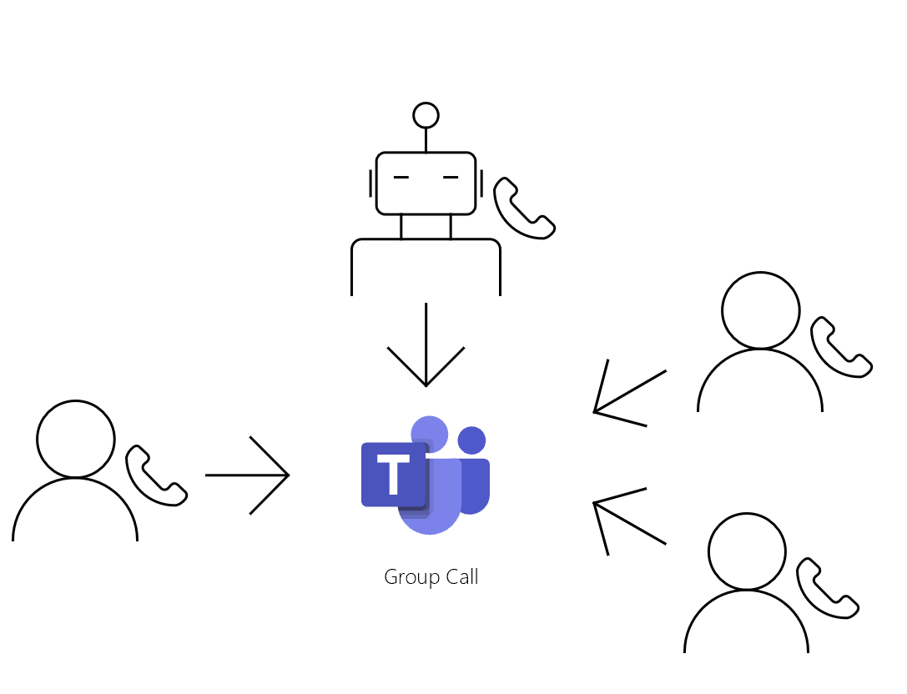

# 呼叫概述

Microsoft Graph 中的云通信 Api 为您的应用程序和服务通过各种通信相关功能（如呼叫和联机会议）与用户进行交互的方式添加了一个新的维度。 本文介绍了受支持的呼叫类型以及它们如何用于信号流程。

## 对等呼叫
当一个参与者直接呼叫另一个参与者时，呼叫是对等 (P2P) 。 如果机器人呼叫用户，并且用户是指定的唯一呼叫目标，则这是 P2P 呼叫的一个示例。

如果用户想要呼叫机器人，bot 不需要任何其他权限即可响应 P2P 呼叫。 为了使 bot 能够呼叫用户，它必须具有 Calls.Initiate。P2P 呼叫的所有权限。

## 组调用

如果呼叫中有三个或更多参与者，或者在最初创建呼叫时指定了 [会议坐标](/graph/api/resources/onlinemeeting) ，则会发生组调用。 

例如，您可以通过 Microsoft 团队创建组呼叫。

目前，bot 能够：
- 创建组调用
- 加入现有的组调用
- 邀请其他参与者加入现有的组呼叫
- 被邀请加入现有的组调用

## 另请参阅

- [云通信 API 概述](cloud-communications-concept-overview.md)
- [呼叫权限](./permissions-reference.md#calls-permissions)