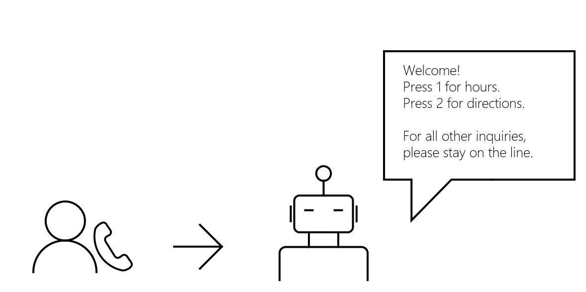

# 云通信 API 概述
Microsoft Graph 中的云通信 Api 为您的应用和服务如何通过各种通信相关功能（如呼叫和联机会议）与用户进行交互，从而添加了一个新的维度。 通过加快您对客户需求的响应方式以及员工相互协作的方式来扩大业务。

## 为什么要与云通信 Api 集成？

了解使用云通信 Api buid 服务应用程序（[bot](https://microsoftgraph.github.io/microsoft-graph-comms-samples/docs/articles/calls/register-calling-bot.html?q=create%20bot)）的好处。

### 处理传入呼叫

当工作人员收到大量业务呼叫且无法回答所有问题时，可能会非常困难。 Bot 可用作前端助理，并通过拒绝似乎是垃圾邮件呼叫以及将特定呼叫重定向（转发）到不同号码来处理这些呼叫。

您可以使用云通信 Api 执行以下操作：

- 让用户通过 VoIP[呼叫机器人](/graph/api/application-post-calls?view=graph-rest-1.0)。
- 如果需要，请让 bot 将[传入呼叫重定向](/graph/api/call-redirect?view=graph-rest-1.0)到相应的代理。
- 有机器人[应答](/graph/api/call-answer?view=graph-rest-1.0)或[拒绝](/graph/api/call-reject?view=graph-rest-1.0)呼叫。

### 简化客户服务体验
无论您是拥有一家大型支持服务还是小型店面，都可能很难处理多个客户请求，尤其是在您没有任何上下文正在尝试提前解决的问题时。 通过**交互式语音响应**（IVR）系统处理来自客户的传入呼叫，其中的 bot 最初将与其进行交互。

当提示客户输入来自 bot 的响应时，客户可以在其所选内容对应的小键盘上按某个键。 然后，机器人可以从客户处收集拨号音多频率（DTMF）。

您可以使用云通信 Api 构建以下 bot：

- [应答](/graph/api/call-answer?view=graph-rest-1.0)来自客户的呼叫。
- [播放提示](/graph/api/call-playprompt?view=graph-rest-1.0)通知并提示客户选择的内容。
- [订阅一个语气](/graph/api/call-subscribetotone?view=graph-rest-1.0)，以便从客户处收集 DTMF。
- 将[客户转移](/graph/api/call-transfer?view=graph-rest-1.0)到代理。
- [结束](/graph/api/call-delete?view=graph-rest-1.0)与客户的通话。

若要在客户和你的 bot 之间创建更智能的交互，当客户收到响应提示时，他们将能够直接谈论他们需要帮助的内容。

与自然语言处理服务集成意味着可以对客户的语音进行分析以查找其看法。 然后，bot 可以相应地响应客户的需求。

>**注意：** 您不能录制或以其他方式保留来自您的应用程序访问的呼叫或会议的媒体内容或从该媒体内容派生的数据。 请确保您符合有关通信的数据保护和机密性的法律和法规。 有关详细信息，请参阅[使用条款](https://docs.microsoft.com/legal/microsoft-apis/terms-of-use)并咨询法律顾问。

您可以使用云通信 Api 构建以下 bot：

- [应答](/graph/api/call-answer?view=graph-rest-1.0)来自客户的呼叫。
- [播放提示](/graph/api/call-playprompt?view=graph-rest-1.0)以通知并提示客户讲话。
- 记录客户讲话的[简短音频剪辑](/graph/api/call-record?view=graph-rest-1.0)。
- 在分析语音后，会向客户发出[提示](/graph/api/call-playprompt?view=graph-rest-1.0)，并提供相应的响应。

### 通过组调用进行协作
允许用户通过创建组呼叫来与同事或客户接洽，以便每个人都可以参与对话。

您可以使用云通信 Api 构建以下 bot：

- 创建具有多个参与者[的组呼叫](/graph/api/application-post-calls?view=graph-rest-1.0#example-3-create-a-group-call-with-service-hosted-media)。
- [邀请另一个 bot 或用户](/graph/api/participant-invite?view=graph-rest-1.0)到现有的组呼叫。
- 将[现有的组呼叫](/graph/api/application-post-calls?view=graph-rest-1.0#example-5-join-scheduled-meeting-with-service-hosted-media)作为 bot 加入。
- 列出组呼叫中[的参与者](/graph/api/call-list-participants?view=graph-rest-1.0)。
- [Mutes 其他参与者](/graph/api/participant-mute?view=graph-rest-1.0)。

### 可靠地发送提醒
若要使用户能够向客户发送约会提醒或付款截止日期的提醒，可以让 bot 自动呼叫客户。 <!--If the customer misses the call, it will leave a voicemail with the automated message. (Add this back once bot to PSTN calling works)-->

您可以使用云通信 Api 构建以下 bot：

- 在团队中[打电话给客户](/graph/api/application-post-calls?view=graph-rest-1.0)。
- [播放录制的提示](/graph/api/call-playprompt?view=graph-rest-1.0)以充当提醒。
- [结束呼叫](/graph/api/call-delete?view=graph-rest-1.0)。

### 设置联机会议
无论是在医生与患者之间还是在用户与其直接下属之间安排会议，您可以生成可生成用户可以依赖的会议的解决方案。 为提高灵活性，用户可以呼叫其他用户，并在正在进行会议时邀请他们加入会议。

您可以使用云通信 Api 执行以下操作：

- 让用户[创建联机会议](/graph/api/application-post-onlinemeetings?view=graph-rest-1.0)。
- 让用户检索联机会议的[详细信息](/graph/api/onlinemeeting-get?view=graph-rest-1.0)。
- 拥有机器人或用户[加入联机会议](/graph/api/application-post-calls?view=graph-rest-1.0#example-5-join-scheduled-meeting-with-service-hosted-media)。

## API 参考
在查找此服务的 API 参考？

- [Microsoft Graph 中的云通信 Api （v1.0）](/graph/api/resources/communications-api-overview?view=graph-rest-1.0)
- [Microsoft Graph 中的云通信 Api （测试版）](/graph/api/resources/communications-api-overview?view=graph-rest-beta)

## 后续步骤

- 使用 bot[开始](cloud-communications-get-started.md)。
- 了解有关[呼叫](cloud-communications-calls.md)、[媒体](cloud-communications-media.md)和[联机会议](cloud-communications-online-meetings.md)的详细信息。
- 查看 API 使用[限制](cloud-communications-limits.md)。
- 了解如何管理你的 bot 的[电话号码](cloud-communications-phone-number.md)。

## 另请参阅

- [委派和应用程序权限](https://docs.microsoft.com/azure/active-directory/develop/v1-permissions-and-consent)
- [通话权限](/graph/permissions-reference#calls-permissions)
- [联机会议权限](/graph/permissions-reference#online-meetings-permissions)
- [云通信示例](https://github.com/microsoftgraph/microsoft-graph-comms-samples)

