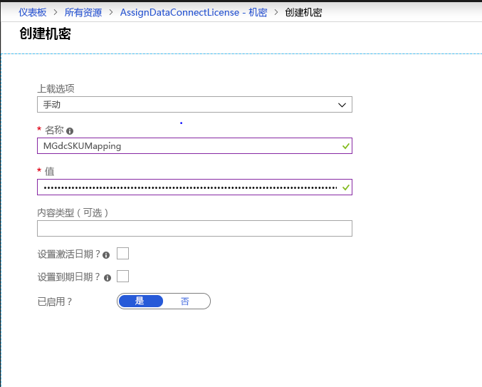

# <a name="microsoft-graph-data-connect-policies-and-licensing"></a>Microsoft Graph 数据连接策略和许可

Microsoft Graph 数据连接使用 [Azure 托管应用程序](https://docs.microsoft.com/zh-CN/azure/managed-applications/overview)，允许你在客户的 Azure 环境中创建和部署解决方案。 托管应用程序允许你支持某些 Azure 策略，让客户能够更加信心十足并舒适地使用你的应用程序。 此外，你必须为安装你的应用程序的一个或多个组织向 Microsoft 购买和申请许可证，以便允许应用程序通过数据连接访问数据。

## <a name="policies"></a>策略

对于使用 Office 365 数据构建的 Azure 托管应用程序，支持使用以下 Azure 策略：

- [ADLS Gen1 加密必需策略](https://docs.microsoft.com/zh-CN/azure/azure-policy/scripts/enforce-datalakestore-encryption)

在 Azure 应用市场发布过程中选择任何策略时，将为应用程序的所有安装检查并实施策略合规性状态。 在数据请求过程中，将向数据审批者显示合规的所有选定策略。 任何策略合规性违规行为将导致管道运行失败并停止数据提取。

如果想要请求为其他策略提供支持，请在 [UserVoice](https://microsoftgraph.uservoice.com/forums/920506-microsoft-graph-feature-requests?category_id=359581) 上告知我们。

## <a name="licensing"></a>许可

可通过按用户按月许可的 Workplace Analytics 访问 Microsoft Graph 数据连接工具集。  拥有 Workplace Analytics 的组织可通过为内部开发的应用程序或独立软件供应商 (ISV) 开发的应用程序授予成规模访问其数据的权限并加以管理，从而能够扩展其 Office 365 数据见解。 若要了解详细信息，包括如何购买，请访问 [Workplace Analytics 产品页面](https://products.office.com/zh-CN/business/workplace-analytics)。

如果你是 ISV，我们还为你提供为尚未购买 Workplace Analytics 的客户构建应用程序的选项。 为此，对于购买你的应用程序的每名客户，你必须购买足够的许可证，以将这些许可证与应用程序将通过 Microsoft Graph 数据连接访问的所有用户相关联。 你可以将此选项与 Workplace Analytics 许可证一起使用。 你将需要采用相关步骤，将 Microsoft Graph 数据连接许可证的实例与其每个客户安装相关联。

### <a name="isvs-using-the-microsoft-graph-data-connect-license"></a>使用 Microsoft Graph 数据连接许可证的 ISV
如果你是使用数据连接许可证的 ISV，你必须已使用 [Azure Key Vault](https://azure.microsoft.com/zh-CN/services/key-vault/) 来存储和处理许可证分配。 你将需要[创建一个密钥保管库](https://docs.microsoft.com/zh-CN/azure/key-vault/quick-create-portal)。 在创建期间，记下密钥保管库 URI 值。 应用程序定义中将使用该值来引用密钥保管库。 创建密钥保管库后，确保应用程序 ARM 模板的源链接服务中使用的 SPN 对其具有访问权限。 为此，请转到密钥保管库实例的“**访问策略**”窗格，为 SPN 引用的应用程序创建一个访问策略，并为应用程序分配“**获取**”和“**列表**”权限。 


为组织分配的 Microsoft Graph 数据连接许可证是在密钥保管库中以密钥形式提供的。 为此，请执行以下操作：
1. 转到密钥保管库，并在“**生成/导入**”下创建一个手动密钥。 密钥的名称必须为 **MGdcSKUMapping**，并且密钥的值必须包含租户的 ID 以及为该租户分配的许可证的数量，格式如下。

`{"tenantId1" : 20, "tenantId2" : 35, "tenantId3" : 12}`

2. 设置值之后，确保其已启用，并选择“**创建**”开始部署。 



3. 你还需要更新应用程序的 ARM 模板以引用创建的密钥保管库。 为此，请填充 **LicenseKeyVaultUri** 属性，该属性必须使用你在创建期间记下的 **KeyVaultUri** 值加以填充。 如图所示，此属性是在应用程序 ARM 模板的源链接服务中提供。 

```
"properties": {
        "type": "Office365",
            "description": "Source O365 linked service",
            "typeProperties": {
                   "office365tenantId": "[subscription().tenantId]",
        "PrivacyPolicyUri": "http://www.wkw.com/privacy",
        "TermsOfUseUri": "http://www.wkw.com/tos",
        "servicePrincipalId": "[variables('sourceLinkedServicePrincipalId')]",
        "servicePrincipalKey": {
                           "type": "SecureString",
                "value": "[variables('sourceLinkedServicePrincipalKey')]"
        },
        "servicePrincipalTenantId": "[variables('sourceLinkedServicePrincipalTenantId')]",
        "LicenseKeyVaultUri": "<KeyVaultUri>",
            }
    }
```

在每次管道运行之前，数据连接将引用密钥保管库中的密钥。 如果为组织分配的许可证不足以为每个用户提供数据，或者密钥保管库不可访问，则它会使管道失败。 

## <a name="next-steps"></a>后续步骤
如果想要请求为其他策略提供支持，请在 [UserVoice](https://microsoftgraph.uservoice.com/forums/920506-microsoft-graph-feature-requests?category_id=359581) 上告知我们。 若要详细了解 Workplace Analytics，包括如何购买，请访问 [Workplace Analytics 产品页面](https://products.office.com/zh-CN/business/workplace-analytics)。
