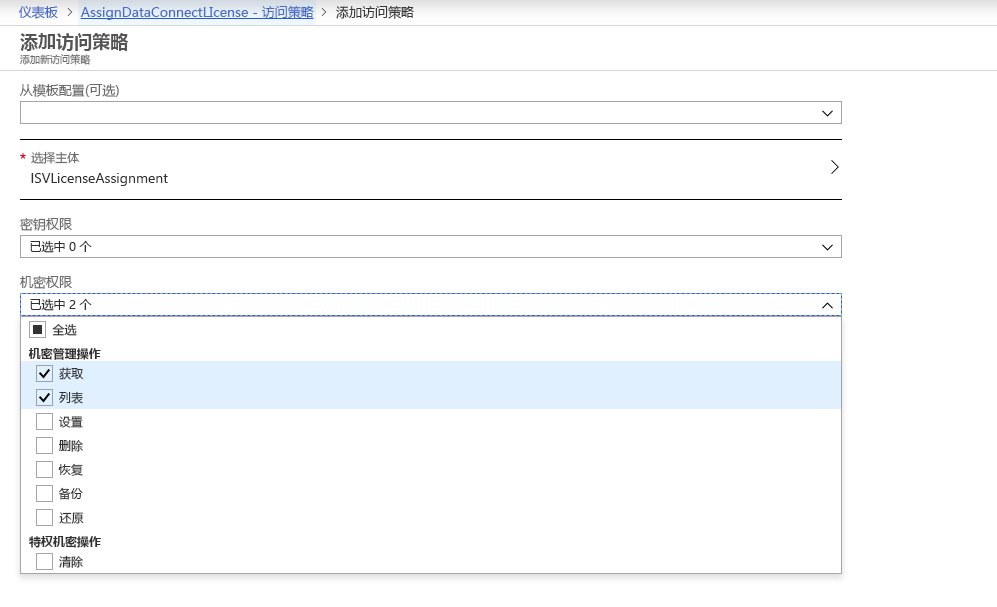

# <a name="microsoft-graph-data-connect-policies-and-licensing"></a><span data-ttu-id="28631-103">Microsoft Graph 数据连接策略和许可</span><span class="sxs-lookup"><span data-stu-id="28631-103">Microsoft Graph data connect policies and licensing</span></span>

<span data-ttu-id="28631-104">Microsoft Graph 数据连接使用 [Azure 托管应用程序](https://docs.microsoft.com/zh-CN/azure/managed-applications/overview)，允许你在客户的 Azure 环境中创建和部署解决方案。</span><span class="sxs-lookup"><span data-stu-id="28631-104">Microsoft Graph data connect uses [Azure managed applications](https://docs.microsoft.com/zh-CN/azure/managed-applications/overview) to allow you to create and deploy your solutions in your customer's Azure environment.</span></span> <span data-ttu-id="28631-105">托管应用程序允许你支持某些 Azure 策略，让客户能够更加信心十足并舒适地使用你的应用程序。</span><span class="sxs-lookup"><span data-stu-id="28631-105">Managed applications allow you to support certain Azure policies, giving customers greater confidence and comfortability when using your applications.</span></span> <span data-ttu-id="28631-106">此外，你必须为安装你的应用程序的一个或多个组织向 Microsoft 购买和申请许可证，以便允许应用程序通过数据连接访问数据。</span><span class="sxs-lookup"><span data-stu-id="28631-106">Additionally, you must purchase and apply licenses from Microsoft your organization or the organizations that install your applications, in order to allow the application to access data through data connect.</span></span>

## <a name="policies"></a><span data-ttu-id="28631-107">策略</span><span class="sxs-lookup"><span data-stu-id="28631-107">Policies</span></span>

<span data-ttu-id="28631-108">对于使用 Office 365 数据构建的 Azure 托管应用程序，支持使用以下 Azure 策略：</span><span class="sxs-lookup"><span data-stu-id="28631-108">The following Azure policies are supported for an Azure managed application built using Office 365 data:</span></span>

- [<span data-ttu-id="28631-109">ADLS Gen1 加密必需策略</span><span class="sxs-lookup"><span data-stu-id="28631-109">ADLS Gen1 Encryption Required Policy</span></span>](https://docs.microsoft.com/zh-CN/azure/azure-policy/scripts/enforce-datalakestore-encryption)

<span data-ttu-id="28631-110">在 Azure 应用市场发布过程中选择任何策略时，将为应用程序的所有安装检查并实施策略合规性状态。</span><span class="sxs-lookup"><span data-stu-id="28631-110">When you select any of the policies during Azure marketplace publishing, the policy compliance status will be checked and enforced for all installations of your application.</span></span> <span data-ttu-id="28631-111">在数据请求过程中，将向数据审批者显示合规的所有选定策略。</span><span class="sxs-lookup"><span data-stu-id="28631-111">All selected policies that are compliant will be shown to the data approvers as part of the data request.</span></span> <span data-ttu-id="28631-112">任何策略合规性违规行为将导致管道运行失败并停止数据提取。</span><span class="sxs-lookup"><span data-stu-id="28631-112">Any policy compliance violation would cause the pipeline run to fail and stop the data extraction.</span></span>

<span data-ttu-id="28631-113">如果想要请求为其他策略提供支持，请在 [UserVoice](https://microsoftgraph.uservoice.com/forums/920506-microsoft-graph-feature-requests?category_id=359581) 上告知我们。</span><span class="sxs-lookup"><span data-stu-id="28631-113">If you would like to request support for additional policies , let us know on [UserVoice](https://microsoftgraph.uservoice.com/forums/920506-microsoft-graph-feature-requests?category_id=359581).</span></span>

## <a name="licensing"></a><span data-ttu-id="28631-114">许可</span><span class="sxs-lookup"><span data-stu-id="28631-114">Licensing</span></span>

<span data-ttu-id="28631-115">可通过按用户按月许可的 Workplace Analytics 访问 Microsoft Graph 数据连接工具集。</span><span class="sxs-lookup"><span data-stu-id="28631-115">Access to the Microsoft Graph data connect toolset is available through Workplace Analytics, which is licensed on a per-user, per-month basis.</span></span>  <span data-ttu-id="28631-116">拥有 Workplace Analytics 的组织可通过为内部开发的应用程序或独立软件供应商 (ISV) 开发的应用程序授予成规模访问其数据的权限并加以管理，从而能够扩展其 Office 365 数据见解。</span><span class="sxs-lookup"><span data-stu-id="28631-116">Organizations with Workplace Analytics can extend their insights from Office 365 data by granting and governing access to their data at scale to applications developed in-house or by independent software vendors (ISVs).</span></span> <span data-ttu-id="28631-117">若要了解详细信息，包括如何购买，请访问 [Workplace Analytics 产品页面](https://products.office.com/zh-CN/business/workplace-analytics)。</span><span class="sxs-lookup"><span data-stu-id="28631-117">To learn more, including how to purchase, visit the [Workplace Analytics product page](https://products.office.com/zh-CN/business/workplace-analytics).</span></span>

<span data-ttu-id="28631-118">如果你是 ISV，我们还为你提供为尚未购买 Workplace Analytics 的客户构建应用程序的选项。</span><span class="sxs-lookup"><span data-stu-id="28631-118">If you’re an ISV, we also provide an option for you to build applications for customers who have not purchased Workplace Analytics.</span></span> <span data-ttu-id="28631-119">为此，对于购买你的应用程序的每名客户，你必须购买足够的许可证，以将这些许可证与应用程序将通过 Microsoft Graph 数据连接访问的所有用户相关联。</span><span class="sxs-lookup"><span data-stu-id="28631-119">To do so, you must purchase enough licenses to associate them with all the users your application will access through Microsoft Graph data connect, for each customer who purchases your application.</span></span> <span data-ttu-id="28631-120">你可以将此选项与 Workplace Analytics 许可证一起使用。</span><span class="sxs-lookup"><span data-stu-id="28631-120">You can use this option along with Workplace Analytics licenses.</span></span> <span data-ttu-id="28631-121">你将需要采用相关步骤，将 Microsoft Graph 数据连接许可证的实例与其每个客户安装相关联。</span><span class="sxs-lookup"><span data-stu-id="28631-121">You’ll need to take steps to associate instances of the Microsoft Graph data connect license with each of their customer installations.</span></span>

### <a name="isvs-using-the-microsoft-graph-data-connect-license"></a><span data-ttu-id="28631-122">使用 Microsoft Graph 数据连接许可证的 ISV</span><span class="sxs-lookup"><span data-stu-id="28631-122">ISVs using the Microsoft Graph data connect license</span></span>
<span data-ttu-id="28631-123">如果你是使用数据连接许可证的 ISV，你必须已使用 [Azure Key Vault](https://azure.microsoft.com/zh-CN/services/key-vault/) 来存储和处理许可证分配。</span><span class="sxs-lookup"><span data-stu-id="28631-123">If you're an ISV using the data connect license, you must utilized [Azure Key Vault](https://azure.microsoft.com/zh-CN/services/key-vault/) to store and process the license assignment.</span></span> <span data-ttu-id="28631-124">你将需要[创建一个密钥保管库](https://docs.microsoft.com/zh-CN/azure/key-vault/quick-create-portal)。</span><span class="sxs-lookup"><span data-stu-id="28631-124">You will need to [create a Key Vault](https://docs.microsoft.com/zh-CN/azure/key-vault/quick-create-portal).</span></span> <span data-ttu-id="28631-125">在创建期间，记下密钥保管库 URI 值。</span><span class="sxs-lookup"><span data-stu-id="28631-125">During creation, note the Key Vault URI value.</span></span> <span data-ttu-id="28631-126">应用程序定义中将使用该值来引用密钥保管库。</span><span class="sxs-lookup"><span data-stu-id="28631-126">It will be used in the application definition to reference the Key Vault.</span></span> <span data-ttu-id="28631-127">创建密钥保管库后，确保应用程序 ARM 模板的源链接服务中使用的 SPN 对其具有访问权限。</span><span class="sxs-lookup"><span data-stu-id="28631-127">After you create the Key Vault, ensure that the SPN used in the Source Linked Service of the application's ARM template has access to it.</span></span> <span data-ttu-id="28631-128">为此，请转到密钥保管库实例的“**访问策略**”窗格，为 SPN 引用的应用程序创建一个访问策略，并为应用程序分配“**获取**”和“**列表**”权限。</span><span class="sxs-lookup"><span data-stu-id="28631-128">To do so, go to the **Access Policies** pane of the Key Vault instance, create an access policy for the application referenced by the SPN, and assign **Get** and **List** permissions to the application.</span></span> 



<span data-ttu-id="28631-130">为组织分配的 Microsoft Graph 数据连接许可证是在密钥保管库中以密钥形式提供的。</span><span class="sxs-lookup"><span data-stu-id="28631-130">The assignment of Microsoft Graph data connect licenses to organizations is provided as a secret in the Key Vault.</span></span> <span data-ttu-id="28631-131">为此，请执行以下操作：</span><span class="sxs-lookup"><span data-stu-id="28631-131">To do so:</span></span>
1. <span data-ttu-id="28631-132">转到密钥保管库，并在“**生成/导入**”下创建一个手动密钥。</span><span class="sxs-lookup"><span data-stu-id="28631-132">Go to the Key Vault and under **Generate/Import**, create a manual secret.</span></span> <span data-ttu-id="28631-133">密钥的名称必须为 **MGdcSKUMapping**，并且密钥的值必须包含租户的 ID 以及为该租户分配的许可证的数量，格式如下。</span><span class="sxs-lookup"><span data-stu-id="28631-133">The name of the secret must be **MGdcSKUMapping** and the value of the secret must contain the ID of the tenant and the number of licenses allocated to that tenant, in the following format.</span></span>

`{"tenantId1" : 20, "tenantId2" : 35, "tenantId3" : 12}`

2. <span data-ttu-id="28631-134">设置值之后，确保其已启用，并选择“**创建**”开始部署。</span><span class="sxs-lookup"><span data-stu-id="28631-134">After setting the value, make sure that it is enabled and select **Create** to begin the deployment.</span></span> 


3. <span data-ttu-id="28631-136">你还需要更新应用程序的 ARM 模板以引用创建的密钥保管库。</span><span class="sxs-lookup"><span data-stu-id="28631-136">You also need to update the application's ARM template to reference the Key Vault that you created.</span></span> <span data-ttu-id="28631-137">为此，请填充 **LicenseKeyVaultUri** 属性，该属性必须使用你在创建期间记下的 **KeyVaultUri** 值加以填充。</span><span class="sxs-lookup"><span data-stu-id="28631-137">To do so, populated the **LicenseKeyVaultUri** property, which must be populated with the **KeyVaultUri** value you noted during creation.</span></span> <span data-ttu-id="28631-138">如图所示，此属性是在应用程序 ARM 模板的源链接服务中提供。</span><span class="sxs-lookup"><span data-stu-id="28631-138">This property is provided in the Source Linked Service of the application's ARM template, as shown.</span></span> 

```
"properties": {
        "type": "Office365",
            "description": "Source O365 linked service",
            "typeProperties": {
                   "office365tenantId": "[subscription().tenantId]",
        "PrivacyPolicyUri": "http://www.wkw.com/privacy",
        "TermsOfUseUri": "http://www.wkw.com/tos",
        "servicePrincipalId": "[variables('sourceLinkedServicePrincipalId')]",
        "servicePrincipalKey": {
                           "type": "SecureString",
                "value": "[variables('sourceLinkedServicePrincipalKey')]"
        },
        "servicePrincipalTenantId": "[variables('sourceLinkedServicePrincipalTenantId')]",
        "LicenseKeyVaultUri": "<KeyVaultUri>",
            }
    }
```

<span data-ttu-id="28631-139">在每次管道运行之前，数据连接将引用密钥保管库中的密钥。</span><span class="sxs-lookup"><span data-stu-id="28631-139">Data connect will reference the secret in the Key Vault before each pipeline run.</span></span> <span data-ttu-id="28631-140">如果为组织分配的许可证不足以为每个用户提供数据，或者密钥保管库不可访问，则它会使管道失败。</span><span class="sxs-lookup"><span data-stu-id="28631-140">It will fail the pipeline if there aren't enough licenses assigned to the organization to provide data for each user, or if the Key Vault is inaccessible.</span></span> 

## <a name="next-steps"></a><span data-ttu-id="28631-141">后续步骤</span><span class="sxs-lookup"><span data-stu-id="28631-141">Next Steps</span></span>
<span data-ttu-id="28631-142">如果想要请求为其他策略提供支持，请在 [UserVoice](https://microsoftgraph.uservoice.com/forums/920506-microsoft-graph-feature-requests?category_id=359581) 上告知我们。</span><span class="sxs-lookup"><span data-stu-id="28631-142">If you would like to request support for additional policies, let us know on [UserVoice](https://microsoftgraph.uservoice.com/forums/920506-microsoft-graph-feature-requests?category_id=359581).</span></span> <span data-ttu-id="28631-143">若要详细了解 Workplace Analytics，包括如何购买，请访问 [Workplace Analytics 产品页面](https://products.office.com/zh-CN/business/workplace-analytics)。</span><span class="sxs-lookup"><span data-stu-id="28631-143">To learn more about Workplace Analytics, including how to purchase, visit the [Workplace Analytics product page](https://products.office.com/zh-CN/business/workplace-analytics).</span></span>
