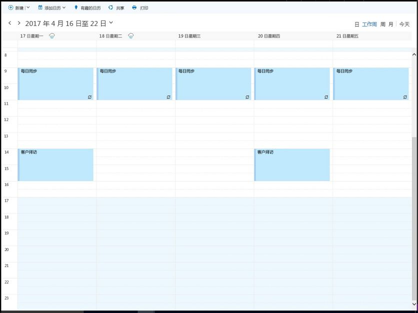

# <a name="find-possible-meeting-times-on-the-outlook-calendar"></a>在 Outlook 日历上找到可能的会议时间

在工作场所或学校，寻找开会的公共时间和场所经常会产生开销。Microsoft Graph 应用程序可使用 [findMeetingTimes](/graph/api/user-findmeetingtimes?view=graph-rest-1.0) 标识满足时间、位置和其他限制条件要求的可能的会议时间。   

**FindMeetingTimes** 操作使你可以指定条件，如会议日期/时间范围、持续时间、可选或必选的与会者，以及活动性质 (**activityDomain**)。该操作考虑到与会者和组织者正常的工作计划和忙/闲状态，并建议适合参与者和活动类型的时间。例如，建议列表会首先列出组织者和与会者工作时间经常发生的与工作相关的活动的建议，以及所需与会者的位置的建议。

在 Office 365 中，可以为每个邮箱配置工作时间和时区。**FindMeetingTimes** 操作处理组织者和与会者之间的时区变化。默认情况下，**findMeetingTimes** 返回 UTC 格式的建议。你可以使用下列请求头，让 **findMeetingTimes** 返回以特定时区表达的建议。
```
Prefer: outlook.timezone="{time-zone-string}}"
```

这对于大型会议特别有用，你可以为仲裁指定一个百分比 (**minimumAttendeePercentage**)，并且让 **findMeetingTimes** 仅在满足最低与会者可用性时返回建议。

如果 **findMeetingTimes** 无法提出任何会议时间建议，则它指示某个特定原因 (**emptySuggestionsReason**)，如组织者或需要的与会者没有空。根据此值，可以更好地调整参数，并重新调用 **findMeetingTimes**。

>**注意** **findMeetingTimes**操作当前仅对 Office 365 工作或学校邮箱可用，对个人 outlook.com 邮箱不可用。

## <a name="example"></a>示例

以下示例显示了如何使用 **findMeetingTimes** 返回 2 个用户可以开会几小时的可能时间，并将用户的闲/忙和工作计划以及与会者离开了某段时间纳入考虑之中。因为仅有 2 个用户参与此会议，建议要求出席率达到 100%。下面显示了用户的忙/闲计划。

### <a name="organizers-calendar"></a>组织者的日历



### <a name="attendees-calendar"></a>与会者的日历


该示例调用 **findMeetingTimes** 两次：

1. 第一次调用在 4 月 18 到 20 日的时间范围内查找。由于与会者在 4 月 18 到 19 日期间外出，4 月 20 日一般不会有空，第一次调用不会返回建议，原因 (**emptySuggestionsReason**) 是与会者没有空。
2. 第二次调用查找 4 月 21 日的可用性并返回下午 2-4 点的建议。

两次 **findMeetingTimes** 调用包含以下参数。**findMeetingTimes** 的所有[参数](/graph/api/user-findmeetingtimes?view=graph-rest-1.0#request-body)都是可选的。

- **与会者**：一位与会者 Samantha Booth 的**类型**属性设置为 `required`
- **locationConstraint**：不需要任何位置建议
- **timeConstraint**：第一次调用查找日期/时间范围 4 月 18 日上午 9 点到 4 月 20 日下午 5 点；如果第一次调用未能建议任何时间，第二次调用查找范围 4 月 21 日上午 9 点到下午 5 点
- **meetingDuration**：两个小时
- **returnSuggestionReasons**：本示例要求为每个建议提供一个原因
- **minimumAttendeePercentage**：100%，因为与会者必须能够在任何建议的时间出席

### <a name="first-request"></a>第一个请求

为两个用户查找 4 月 18 到 20 日之间 2 小时的空闲时间空挡。

<!-- {
  "blockType": "ignored",
  "name": "findmeetingtimes_example_first"
}-->
```http
POST https://graph.microsoft.com/v1.0/me/findMeetingTimes
Prefer: outlook.timezone="Pacific Standard Time"
Content-type: application/json

{ 
  "attendees": [ 
    { 
      "type": "required",  
      "emailAddress": { 
        "name": "Samantha Booth",
        "address": "samanthab@contoso.onmicrosoft.com" 
      } 
    }
  ],  
  "locationConstraint": { 
    "isRequired": false,  
    "suggestLocation": false,  
    "locations": [ 
      { 
        "resolveAvailability": false,
        "displayName": "Conf room Hood" 
      } 
    ] 
  },  
  "timeConstraint": {
    "activityDomain":"work", 
    "timeslots": [ 
      { 
        "start": { 
          "dateTime": "2017-04-18T09:00:00",  
          "timeZone": "Pacific Standard Time" 
        },  
        "end": { 
          "dateTime": "2017-04-20T17:00:00",  
          "timeZone": "Pacific Standard Time" 
        } 
      } 
    ] 
  },  
  "meetingDuration": "PT2H",
  "returnSuggestionReasons": true,
  "minimumAttendeePercentage": 100
}
```

### <a name="first-response"></a>第一个响应
当这两个用户均有空时，4 月 18 到 20 日工作时间内没有 2 小时的时间空挡。
<!-- {
  "blockType": "ignored",
  "truncated": true,
  "@odata.type": "microsoft.graph.meetingTimeSuggestionsResult",
  "isCollection": false
} -->
```http
HTTP/1.1 200 OK
Content-type: application/json
Preference-Applied: outlook.timezone="Pacific Standard Time"
Content-Length: 184

{
    "@odata.context":"https://graph.microsoft.com/v1.0/$metadata#microsoft.graph.meetingTimeSuggestionsResult",
    "emptySuggestionsReason":"AttendeesUnavailable",
    "meetingTimeSuggestions":[

    ]
}
```

### <a name="second-request"></a>第二个请求
在 4 月 21 日寻找 2 小时的时间空挡。
<!-- {
  "blockType": "ignored",
  "name": "findmeetingtimes_example_second"
}-->
```http
POST https://graph.microsoft.com/v1.0/me/findMeetingTimes
Prefer: outlook.timezone="Pacific Standard Time"
Content-type: application/json

{ 
  "attendees": [ 
    { 
      "type": "required",  
      "emailAddress": { 
        "name": "Samantha Booth",
        "address": "samanthab@contoso.onmicrosoft.com" 
      } 
    }
  ],  
  "locationConstraint": { 
    "isRequired": false,  
    "suggestLocation": false,  
    "locations": [ 
      { 
        "resolveAvailability": false,
        "displayName": "Conf room Hood" 
      } 
    ] 
  },  
  "timeConstraint": {
    "activityDomain":"work", 
    "timeslots": [ 
      { 
        "start": { 
          "dateTime": "2017-04-21T09:00:00",  
          "timeZone": "Pacific Standard Time" 
        },  
        "end": { 
          "dateTime": "2017-04-21T17:00:00",  
          "timeZone": "Pacific Standard Time" 
        } 
      } 
    ] 
  },  
  "meetingDuration": "PT2H",
  "returnSuggestionReasons": true,
  "minimumAttendeePercentage": 100
}
```

### <a name="second-response"></a>第二个响应
第二个 **findMeetingTimes** 请求建议两个用户在 4 月 21 日下午 2-4 点开会。
<!-- {
  "blockType": "ignored",
  "truncated": true,
  "@odata.type": "microsoft.graph.meetingTimeSuggestionsResult",
  "isCollection": false
} -->
```http
HTTP/1.1 200 OK
Content-type: application/json
Preference-Applied: outlook.timezone="Pacific Standard Time"
Content-Length: 714

{
    "@odata.context":"https://graph.microsoft.com/v1.0/$metadata#microsoft.graph.meetingTimeSuggestionsResult",
    "emptySuggestionsReason":"",
    "meetingTimeSuggestions":[
        {
            "confidence":100.0,
            "organizerAvailability":"free",
            "suggestionReason":"Suggested because it is one of the nearest times when all attendees are available.",
            "meetingTimeSlot":{
                "start":{
                    "dateTime":"2017-04-21T14:00:00.0000000",
                    "timeZone":"Pacific Standard Time"
                },
                "end":{
                    "dateTime":"2017-04-21T16:00:00.0000000",
                    "timeZone":"Pacific Standard Time"
                }
            },
            "attendeeAvailability":[
                {
                    "availability":"free",
                    "attendee":{
                        "type":"required",
                        "emailAddress":{
                            "address":"samanthab@contoso.onmicrosoft.com"
                        }
                    }
                }
            ],
            "locations":[
                {
                    "displayName":"Conf room Hood"
                }
            ]
        }
    ]
}
```


## <a name="next-steps"></a>后续步骤

有时，不是所有与会者都可以参加会议。如果与会者的_置信度_达到某个百分比（可指定 **minimumAttendeePercentage** 可选参数），你可以让 **findMeetingTimes** 建议一个时间。了解有关[会议建议置信度](/graph/api/user-findmeetingtimes?view=graph-rest-1.0#the-confidence-of-a-meeting-suggestion)和其他[参数](/graph/api/user-findmeetingtimes?view=graph-rest-1.0#request-body)的详细信息，并根据需要将其用于大型会议。

获取会议时间建议后，可能需要：

1. [创建事件并将其作为会议请求发送](/graph/api/user-post-events?view=graph-rest-1.0)。
2. 在事件中[添加附件](/graph/api/event-post-attachments?view=graph-rest-1.0)。

了解更多关于[与 Outlook 日历集成](outlook-calendar-concept-overview.md)的信息。
