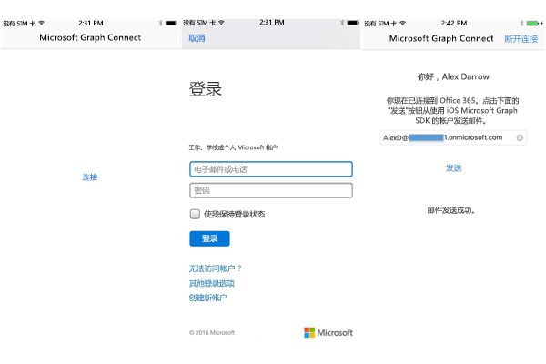

# <a name="get-started-with-microsoft-graph-in-an-objectve-c-ios-app"></a>在 Objective-C iOS 应用中开始使用 Microsoft Graph

> **为企业客户生成应用？**如果企业客户启用企业移动性安全功能，如<a href="https://azure.microsoft.com/en-us/documentation/articles/active-directory-conditional-access-device-policies/" target="_newtab">条件性设备访问</a>，应用可能无法运行。在这种情况下，你可能不知道，而且客户可能会遇到错误。 

> 若要跨**所有企业方案**支持**全部企业客户**，必须使用 Azure AD 终结点，并使用 [Azure 门户](https://aka.ms/aadapplist)管理应用。有关详细信息，请参阅[在 Azure AD 和 Azure AD v2.0 终结点之间进行选择](../concepts/auth_overview.md#deciding-between-the-azure-ad-and-azure-ad-v20-endpoints)。

本文介绍了从 [Azure AD v2.0 终结点](https://developer.microsoft.com/zh-CN/graph/docs/concepts/converged_auth) 获取访问令牌和调用 Microsoft Graph 所需的任务。本文演示了 [适用于 iOS 的 Office 365 Connect 示例 (SDK)](https://github.com/microsoftgraph/ios-objectivec-connect-sample) 中的代码，以说明你在使用 Microsoft Graph 的应用中必须实现的主要概念。本文介绍了如何通过使用 [适用于 iOS 的Microsoft Graph SDK](https://github.com/microsoftgraph/msgraph-sdk-ios) 来访问 Microsoft Graph。

可以在以下 GitHub 存储库中下载要创建的应用版本：

* [使用 Microsoft Graph SDK 的适用于 iOS 的 Office 365 Connect 示例](https://github.com/microsoftgraph/ios-objectivec-connect-sample)

下图显示了将要创建的应用。




将工作流连接到 Microsoft Graph 并进行身份验证，通过工作或个人帐户登录，最后向收件人发送邮件。

**不想生成一个应用吗？**使用 [Microsoft Graph 快速入门](https://graph.microsoft.io/zh-CN/getting-started) 快速准备就绪并开始运行。

## <a name="prerequisites"></a>先决条件

若要开始，将需要以下各项： 

* Apple 的 [Xcode](https://developer.apple.com/xcode/downloads/)
* 安装 [CocoaPods](https://guides.cocoapods.org/using/using-cocoapods.html) 作为依存关系管理器。
* 一个 [Microsoft 帐户](https://www.outlook.com/) 或者一个[工作或学校帐户](http://dev.office.com/devprogram)
* [适用于 iOS 的 Microsoft Graph 初学者项目](https://github.com/microsoftgraph/ios-objectivec-connect-sample) 本模板包含可向其添加代码的类。 若要获取此项目，请在此位置克隆或下载示例项目，然后可以使用 **starter-project** 文件夹中的工作区 (**ios-objectivec-connect-sample.xcworkspace**)。

## <a name="register-the-app"></a>注册应用
 
1. 使用个人或工作或学校帐户登录到 [应用注册门户](https://apps.dev.microsoft.com/)。
2. 选择“**添加应用**”。
3. 为应用输入名称，并选择“**创建应用程序**”。
    
    将显示注册页，其中列出应用的属性。
 
4. 在“平台”****下，选择“添加平台”****。
5. 选择“本机平台”****。
6. 将客户端 ID 复制到剪贴板。将需要在示例应用中输入该值。

    应用 ID 是应用的唯一标识符。 

7. 选择“**保存**”。

## <a name="importing-the-project-dependencies"></a>导入项目依赖项

1. 克隆该存储库，[使用 Microsoft Graph SDK 的适用于 iOS 的 Office 365 Connect 示例](https://github.com/microsoftgraph/ios-objectivec-connect-sample)。 
>重要说明：使用的是 starter-project 文件夹中的示例，而不是项目根目录中的示例。

2. 使用 CocoaPods 导入 Microsoft Graph SDK 和身份验证依赖项。该示例应用已包含可将 pod 导入到项目中的 pod 文件。导航至“**终端**”应用中的“**starter-project**”文件夹，然后在“**终端**”中运行：

        pod install

   将收到已将 pod 导入到项目的确认消息。有关详细信息，请参阅 [CocoaPods](https://guides.cocoapods.org/using/using-cocoapods.html)


## <a name="enable-keychain-sharing"></a>启用密钥链共享
 
对于 Xcode 8，将需要添加密钥链组，否则应用将无法访问密钥链。添加密钥链组：
 
1. 在 Xcode 项目管理器面板上选择项目。(⌘ + 1)。
 
2. 选择“iOS-ObjectiveC-Connect-Sample”****。
 
3. 在“功能”选项卡上启用“密钥链共享”****。
 
4. 将 **com.microsoft.ios-objectivec-connect-sample** 添加到钥匙链组。
 

## <a name="authenticating-with-microsoft-graph"></a>使用 Microsoft Graph 进行身份验证

若要重新访问 UI 工作流，应用需要验证用户身份，然后他们就可以向特定用户发送邮件。若要生成对 Microsoft Graph 服务的请求，必须提供身份验证提供程序（它能够使用适当的 OAuth 2.0 持有者令牌对 HTTPS 请求进行身份验证）。在示例项目中，具有已作为存根的名为 **AuthenticationProvider.m** 的身份验证类。我们将向请求添加一个函数，然后获取一个调用 Microsoft Graph API 的访问令牌。 

1. 打开“**starter-project**”文件夹中的 Xcode 项目工作区 (**iOS-ObjectiveC-Connect-Sample.xcworkspace**)，然后导航至“**身份验证**”文件夹并打开文件 **AuthenticationProvider.m**。 将下列代码添加至该类。

```objectivec
   -(void) connectToGraphWithClientId:(NSString *)clientId scopes:(NSArray *)scopes completion:(void (^)    (NSError *))completion{
      [NXOAuth2AuthenticationProvider setClientId:kClientId scopes:scopes];
      /**
      Obtains access token by performing login with UI, where viewController specifies the parent view controller.
      @param viewController The view controller to present the UI on.
      @param completionHandler The completion handler to be called when the authentication has completed.
      error should be non nil if there was no error, and should contain any error(s) that occurred.
      */

      if ([[NXOAuth2AuthenticationProvider sharedAuthProvider] loginSilent]) {
         completion(nil);
      }
      else {
         [[NXOAuth2AuthenticationProvider sharedAuthProvider] loginWithViewController:nil completion:^(NSError *error) {
            if (!error) {
               NSLog(@"Authentication successful.");
               completion(nil);
            }
            else {
               NSLog(@"Authentication failed - %@", error.localizedDescription);
               completion(error);
            }
         }];
      }
   }
```     

2. 接下来，将此方法添加至头文件。打开文件 **AuthenticationProvider.h**，然后将下列代码添加至此类。
   ```objectivec
   -(void) connectToGraphWithClientId:(NSString *)clientId
                               scopes:(NSArray *)scopes
                           completion:(void (^)(NSError *error))completion;
   ```

2. 最后，我们将从 **ConnectViewController.m** 中调用此方法。该控制器是应用加载的默认视图，其中存在名称为“**连接**”的单个按钮，用户将点按此按钮启动身份验证流程。此方法采用两个参数，即 **Client ID** 和 **scopes**，我们将在后续部分详细介绍它们。将以下操作添加到 **ConnectViewController.m**。

```objectivec
- (IBAction)connectTapped:(id)sender {
   [self showLoadingUI:YES];
   NSArray *scopes = [kScopes componentsSeparatedByString:@","];
   [self.authProvider connectToGraphWithClientId:kClientId scopes:scopes completion:^(NSError *error) {
   if (!error) {
      [self performSegueWithIdentifier:@"showSendMail" sender:nil];
      [self showLoadingUI:NO];
      NSLog(@"Authentication successful.");
   }
   else{
      NSLog(NSLocalizedString(@"CHECK_LOG_ERROR", error.localizedDescription));
      [self showLoadingUI:NO];
   };
  }];
}
```     

## <a name="send-an-email-with-microsoft-graph"></a>使用 Microsoft Graph 发送电子邮件

将项目配置为可以进行身份验证后，下一项任务则是使用 Microsoft Graph API 向用户发送邮件。默认情况下，将已登录用户视作收件人，但是可以将其更改为其他任何收件人。我们在此处要使用的代码位于“**控制器**”文件夹和 **SendMailViewController.m** 类中。将看到在此处展示了用于 UI 的其他代码，还有一个用来从 Microsoft Graph 服务检索用户个人资料信息的 Helper 方法。我们将着重介绍创建邮件并发送邮件的方法。

1. 打开“控制器”文件夹中的 **SendMailViewController.m**，并在 `self.graphClient = [MSGraphClient client]` 后将以下代码添加到 **viewDidLoad** 方法。
   ```objectivec
       [self getUserInfo:(self.emailAddress) completion:^( NSError *error) {
        if (!error) {
            [self getUserPicture:(self.emailAddress)  completion:^(UIImage *image, NSError *error) {
                if (!error) {
                    self.userPicture = image;
                } else {
                    //get the test image out of the project resources
                    self.userPicture = [UIImage imageNamed:(@"test.png")];
                }
                [self uploadPictureToOneDrive:(self.userPicture) completion:^(NSString *webUrl, NSError *error) {
                    if (!error) {
                        self.pictureWebUrl = webUrl;
                        dispatch_async(dispatch_get_main_queue(), ^{
                            self.sendMailButton.enabled = true;
                        });
                    } else {
                        dispatch_async(dispatch_get_main_queue(), ^{
                            NSLog(NSLocalizedString(@"ERROR", ""), error.localizedDescription);
                            self.statusTextView.text = NSLocalizedString(@"PICTURE_UPLOAD_FAILURE", comment: "");
                        });
                    }
                }];
            }];
        }
    }];
   ```

1. 打开“控制器”文件夹中的 **SendMailViewController.m** ，将下列 Helper 方法添加到类中
```objectivec
  //Create a sample test message to send to specified user account
  -(MSGraphMessage*) getSampleMessage{
      MSGraphMessage *message = [[MSGraphMessage alloc]init];
      MSGraphRecipient *toRecipient = [[MSGraphRecipient alloc]init];
      MSGraphEmailAddress *email = [[MSGraphEmailAddress alloc]init];
    
      //need to get email text field for send to!
    
      email.address = self.emailAddress;
      toRecipient.emailAddress = email;
    
      NSMutableArray *toRecipients = [[NSMutableArray alloc]init];
      [toRecipients addObject:toRecipient];
    
      message.subject = NSLocalizedString(@"MAIL_SUBJECT", comment: "");
    
      MSGraphItemBody *emailBody = [[MSGraphItemBody alloc]init];
      NSString *htmlContentPath = [[NSBundle mainBundle] pathForResource:@"EmailBody" ofType:@"html"];
      NSString *htmlContentString = [NSString stringWithContentsOfFile:htmlContentPath encoding:NSUTF8StringEncoding error:nil];
    
      emailBody.content = htmlContentString;
      NSString *replaceString = @"a href=";
      replaceString = [replaceString stringByAppendingString:(self.pictureWebUrl)];
      emailBody.content = [emailBody.content stringByReplacingOccurrencesOfString:(@"a href=%s") withString:(replaceString)];
      emailBody.contentType = [MSGraphBodyType html];
      message.body = emailBody;
    
      message.toRecipients = toRecipients;
    
      MSGraphFileAttachment *fileAttachment= [[MSGraphFileAttachment alloc]init];
      fileAttachment.oDataType = @"#microsoft.graph.fileAttachment";
      fileAttachment.contentType = @"image/png";
    
      NSString *decodedString = [UIImagePNGRepresentation(self.userPicture) base64EncodedStringWithOptions:NSDataBase64EncodingEndLineWithCarriageReturn];
    
      fileAttachment.contentBytes = decodedString;
      fileAttachment.name = @"me.png";
      message.attachments = [message.attachments arrayByAddingObject:(fileAttachment)];
      return message;
    
    }
```
3. 打开 **SendMailViewController.m** 并将以下方法添加到类中。
**uploadPictureToOneDrive** 从用户的[用户](https://developer.microsoft.com/zh-CN/graph/docs/api-reference/v1.0/resources/user)信息上传[用户](https://developer.microsoft.com/zh-CN/graph/docs/api-reference/v1.0/resources/user)的个人资料图片，并返回由示例发送的要嵌入电子邮件正文中的 Web 共享 URL。

  ```objectivec
  -(void) uploadPictureToOneDrive: (UIImage *) image completion:(void(^) (NSString*, NSError*))completionBlock{
    
    NSData *data = UIImagePNGRepresentation(image);
    [[[[[[[self.graphClient me]
          drive]
         root]
        children]
       driveItem:(@"me.png")]
      contentRequest]
     uploadFromData:(data) completion:^(MSGraphDriveItem *response, NSError *error) {
         
         if (!error) {
             NSString *webUrl = response.webUrl;
             completionBlock(webUrl, error);
         } else {
             dispatch_async(dispatch_get_main_queue(), ^{
                 self.statusTextView.text =  NSLocalizedString(@"USER_GET_PICTURE_FAILURE", comment: "");
                 NSLog(NSLocalizedString(@"ERROR", ""), error.localizedDescription);
             });
         }
     }];
    }
  ```
4. 打开 **SendMailViewController.m** 并将以下方法添加到类中。 
**getUserPicture** 返回[用户](https://developer.microsoft.com/zh-CN/graph/docs/api-reference/v1.0/resources/user)的个人资料图片（如果可用）。
   ```objectivec
   -(void) getUserPicture: (NSString *)url completion:(void(^) (UIImage*, NSError*))completionBlock {
    
    [[[self.graphClient me] photoValue] downloadWithCompletion:^(NSURL *location, NSURLResponse *response, NSError *error) {
        //code
        if (!error) {
            NSData *data = [NSData dataWithContentsOfURL:location];
            UIImage *img = [[UIImage alloc] initWithData:data];
            completionBlock(img, error);
        } else{
            completionBlock(nil, error);

        }
    }];
    }

   ```
3. 打开 **SendMailViewcontroller.m** 并将以下方法添加到类中。
此方法获取可表示经过身份验证的用户的 [user](https://developer.microsoft.com/zh-CN/graph/docs/api-reference/v1.0/resources/user) 资源，并缓存必要的字段以获取用户的个人资料图片并发送电子邮件。
   ```objectivec
   //Retrieve the logged in user's display name and email address
   -(void) getUserInfo: (NSString *)url completion:(void(^) ( NSError*))completionBlock{
    
    [[[self.graphClient me]request]getWithCompletion:^(MSGraphUser *response, NSError *error) {
        if(!error){
            dispatch_async(dispatch_get_main_queue(), ^{
                self.emailAddress = response.userPrincipalName;
                self.emailTextField.text = self.emailAddress;
                self.headerLabel.text = [NSString stringWithFormat:(NSLocalizedString(@"HI_USER", comment "")), response.displayName];
                self.statusTextView.text =  NSLocalizedString(@"USER_INFO_LOAD_SUCCESS", comment: "");
            });

            completionBlock(nil);
        }
        else{
            dispatch_async(dispatch_get_main_queue(), ^{
                self.statusTextView.text =  NSLocalizedString(@"USER_INFO_LOAD_FAILURE", comment: "");
                NSLog(NSLocalizedString(@"ERROR", ""), error.localizedDescription);
            });
            completionBlock(error);
        }
    }];
    
   }

   ```
3. 打开 **SendMailViewController.m** 将以下发送邮件方法添加到类中。
**getSampleMessage** 创建 HTML 示例邮件草稿以用于演示目的。 下一个方法 **sendMail** 将获取该邮件，然后执行该请求发送邮件。 同样，默认收件人为登录用户。


  ```objectivec
   //Send mail to the specified user in the email text field
   -(void) sendMail {
    MSGraphMessage *message = [self getSampleMessage];
    MSGraphUserSendMailRequestBuilder *requestBuilder = [[self.graphClient me]sendMailWithMessage:message saveToSentItems:true];
    NSLog(@"%@", requestBuilder);
    MSGraphUserSendMailRequest *mailRequest = [requestBuilder request];
    [mailRequest executeWithCompletion:^(NSDictionary *response, NSError *error) {
        if(!error){
            NSLog(@"response %@", response);
             dispatch_async(dispatch_get_main_queue(), ^{
                self.statusTextView.text = NSLocalizedString(@"SEND_SUCCESS", comment: "");
                self.descriptionLabel.text = @"Check your inbox. You have a new message :)";
            });
        }
        else {
            dispatch_async(dispatch_get_main_queue(), ^{
                NSLog(NSLocalizedString(@"ERROR", ""), error.localizedDescription);
                self.statusTextView.text = NSLocalizedString(@"SEND_FAILURE", comment: "");
            });
        }
    }];
   }
   ```


## <a name="run-the-app"></a>运行应用
1. 运行示例前需要提供在“**注册应用**”部分的注册过程中收到的客户端 ID。打开“**应用程序**”文件夹下的 **AuthenticationConstants.m**。你会发现，注册过程中的 ClientID 可以被添加到文件顶部：  
   ```objectivec
   // You will set your application's clientId
   NSString * const kClientId    = @"ENTER_YOUR_CLIENT_ID";
   NSString * const kScopes = @"https://graph.microsoft.com/User.Read, https://graph.microsoft.com/Mail.ReadWrite, https://graph.microsoft.com/Mail.Send, https://graph.microsoft.com/Files.ReadWrite";
   ```      

>注意：你会注意到为该项目配置了以下权限范围：**https://graph.microsoft.com/Mail.Send”、 “https://graph.microsoft.com/User.Read”、 “offline_access”**。该项目中所使用的服务调用，向你的邮件帐户发送邮件并检索一些个人资料信息（显示名称、电子邮件地址）需要这些应用的权限以正常运行。

2. 运行示例，点击“**连接**”，使用你的个人帐户、工作或学校帐户登录，并授予所请求的权限。

3. 选择“**发送电子邮件**”按钮。在邮件发送后，按钮下方将显示成功消息。

## <a name="next-steps"></a>后续步骤
- 使用 [Graph 浏览器](https://graph.microsoft.io/graph-explorer) 试用 REST API。
- 可在 [Microsoft Graph iOS Objective C 代码段示例](https://github.com/microsoftgraph/ios-objectiveC-snippets-sample) 中找到 REST 和 SDK 操作的常见操作示例。

## <a name="see-also"></a>另请参阅
- [适用于 iOS 的 Microsoft Graph SDK](https://github.com/microsoftgraph/msgraph-sdk-ios)
- [Azure AD v2.0 协议](https://azure.microsoft.com/zh-CN/documentation/articles/active-directory-v2-protocols/)
- [Azure AD v2.0 令牌](https://azure.microsoft.com/zh-CN/documentation/articles/active-directory-v2-tokens/)
