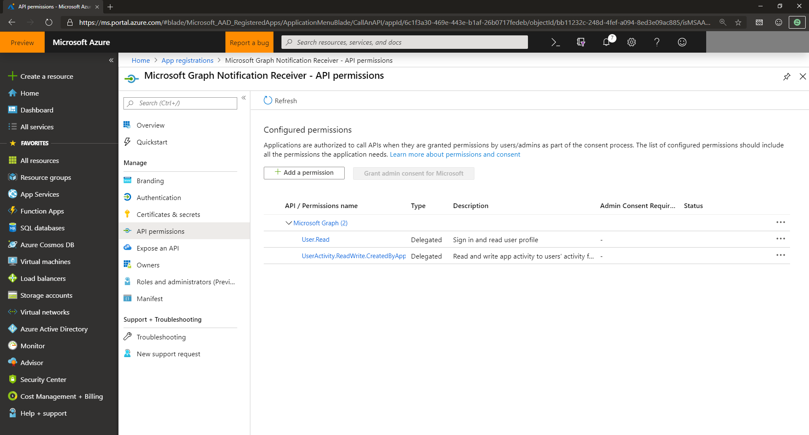

# 管理 Microsoft Graph 通知的应用注册和 API 权限

若要让应用程序服务与 Microsoft Graph 通知集成，你需要通过 Microsoft 标识平台注册应用，以支持 Microsoft 帐户或工作或学校帐户，并删除所需的 API 权限。

## 注册应用，以支持 Microsoft 帐户或工作或学校帐户

在 [Microsoft Azure 门户](https://portal.azure.com/#home)上注册应用程序，以支持 Microsoft 帐户或工作或学校帐户。 如果已在 [Microsoft 应用程序门户](https://apps.dev.microsoft.com/)上注册帐户，则现有应用将在新增和改进的 Azure 门户体验中显示。

有关如何注册应用的信息，请参阅[向 Microsoft 标识平台注册应用程序](auth-register-app-v2.md)。 

> [!NOTE]
> 如果没有 Microsoft 帐户并想要使用此类帐户，请转至  [Microsoft 帐户](https://account.microsoft.com/account)页面。 如果正在编写需要将 Azure AD v1.0 用作工作或学校帐户的身份验证和标识框架的应用，请参阅  [Azure Active Directory 身份验证库](https://docs.microsoft.com/azure/active-directory/develop/active-directory-authentication-libraries)。 如果你想了解或使用新聚合的 Microsoft 标识平台 (v2.0)，请参阅[比较 Microsoft 标识平台终结点和 Azure AD v1.0 终结点](https://docs.microsoft.com/en-us/azure/active-directory/develop/azure-ad-endpoint-comparison)。

注册应用时，请将应用程序 ID/客户端 ID 置于方便使用的位置。 后续在 [Microsoft 合作伙伴中心](https://partner.microsoft.com/)注册应用程序以获取跨设备体验时，需要此 ID。

## 应用证书和密码

若要使应用程序在获取身份验证令牌时对自己进行标识和身份验证，你可以转至 Azure 门户中的**证书和密码**，以上传自己的证书或创建信的客户端密码。
    

    
> [!NOTE]
> 如果选择生成新的客户端密码，请确保将其复制并保存到安全的位置。 离开门户后，你将无法再次访问它。

## API 权限

需要添加其他权限才能使用 Microsoft Graph 通知。 选择“**添加权限**”，在 Microsoft API 下，选择“**Microsoft Graph**”，然后选择“**委派权限**”。
    

    
添加以下权限：

- User.Read - 允许应用程序登录你的用户

- Device.Read - 允许标识用户的设备列表

- Device.Command - 允许通信至用户的设备

- UserActivity.ReadWrite.CreatedByApp - 允许应用订阅以获取通知检索

- Notifications.ReadWrite.CreatedByApp - 允许通知访问和传送

- wns.connect - 允许连接至 Windows 通知服务

## 后续步骤

详细了解[权限和同意](https://docs.microsoft.com/en-us/azure/active-directory/develop/v2-permissions-and-consent)或查看 Microsoft Graph [权限参考](https://docs.microsoft.com/en-us/graph/permissions-reference)。

现在，你已注册应用，请转至[合作伙伴中心](https://partner.microsoft.com/)设置应用程序以获取跨设备体验，并定位相应的应用平台以获取通过 Microsoft Graph 发送的通知。 有关详细信息，请参阅[载入跨设备体验](notifications-integration-cross-device-experiences-onboarding.md)。 
