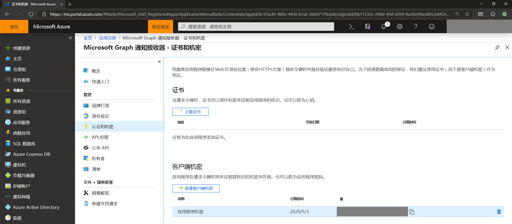
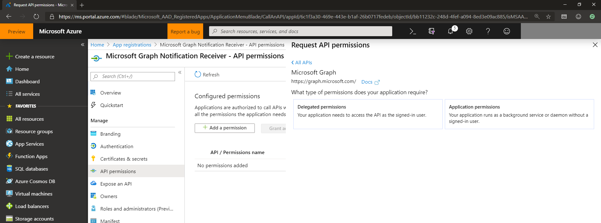

# 管理 Microsoft Graph 通知的应用注册和 API 权限Manage app registration and API permission for Microsoft Graph notifications

若要让应用程序服务与 Microsoft Graph 通知集成，你需要通过 Microsoft 标识平台注册应用，以支持 Microsoft 帐户或工作或学校帐户，并删除所需的 API 权限。In order for your application service to integrate with Microsoft Graph notifications, you need to register your app with the Microsoft identity platform to support Microsoft accounts or work or school accounts, and declare the API permissions that are required.

## 注册应用，以支持 Microsoft 帐户或工作或学校帐户Register your app to support Microsoft accounts or work or school accounts

在 [Microsoft Azure 门户](https://portal.azure.com/#home)上注册应用程序，以支持 Microsoft 帐户或工作或学校帐户。Register your application on the [Microsoft Azure portal](https://portal.azure.com/#home) to support Microsoft accounts or work or school accounts. 如果已在 [Microsoft 应用程序门户](https://apps.dev.microsoft.com/)上注册帐户，则现有应用将在新增和改进的 Azure 门户体验中显示。If you’ve previously registered your application on the [Microsoft Application Portal](https://apps.dev.microsoft.com/), your existing apps will show up in the new and improved Azure portal experience.

有关如何注册应用的信息，请参阅[向 Microsoft 标识平台注册应用程序](auth-register-app-v2.md)。For information about how to register your apps, see [Register an application with the Microsoft identity platform](auth-register-app-v2.md). 

> [!NOTE]
> 如果没有 Microsoft 帐户并想要使用此类帐户，请转至  [Microsoft 帐户](https://account.microsoft.com/account)页面。If you don't already have a Microsoft account and would like to use one, go to the [Microsoft account](https://account.microsoft.com/account) page. 如果正在编写需要将 Azure AD v1.0 用作工作或学校帐户的身份验证和标识框架的应用，请参阅  [Azure Active Directory 身份验证库](https://docs.microsoft.com/azure/active-directory/develop/active-directory-authentication-libraries)。If you're writing an app that needs to use Azure AD v1.0 as an authentication and identity framework for work or school accounts, see [Azure Active Directory Authentication Libraries](https://docs.microsoft.com/azure/active-directory/develop/active-directory-authentication-libraries). 如果你想了解或使用新聚合的 Microsoft 标识平台 (v2.0)，请参阅[比较 Microsoft 标识平台终结点和 Azure AD v1.0 终结点](https://docs.microsoft.com/en-us/azure/active-directory/develop/azure-ad-endpoint-comparison)。If you’re interested in learning about or using the new converged Microsoft identity platform (v2.0), see [Comparing the Microsoft identity platform endpoint and Azure AD v1.0 endpoint](https://docs.microsoft.com/en-us/azure/active-directory/develop/azure-ad-endpoint-comparison).

注册应用时，请将应用程序 ID/客户端 ID 置于方便使用的位置。When you register your app, keep the application ID/client ID somewhere handy. 后续在 [Microsoft 合作伙伴中心](https://partner.microsoft.com/)注册应用程序以获取跨设备体验时，需要此 ID。You'll need this ID later when you register your application for cross-device experiences in the [Microsoft Partner Center](https://partner.microsoft.com/).

## 应用证书和密码App certificates and secrets

若要使应用程序在获取身份验证令牌时对自己进行标识和身份验证，你可以转至 Azure 门户中的**证书和密码**，以上传自己的证书或创建信的客户端密码。To enable your application to identify and authenticate itself when obtaining auth tokens, you can either upload your own certificate or create a new client secret by going to **Certificates & secrets** in the Azure portal.
    

    
> [!NOTE]
> 如果选择生成新的客户端密码，请确保将其复制并保存到安全的位置。If you opt to generate a new client secret, be sure to copy and keep it in a safe place. 离开门户后，你将无法再次访问它。You won’t be able to access it again after you leave the portal.

## API 权限Configure API permissions

需要添加其他权限才能使用 Microsoft Graph 通知。You'll need to add additional permissions in order to use Microsoft Graph notifications. 选择“**添加权限**”，在 Microsoft API 下，选择“**Microsoft Graph**”，然后选择“**委派权限**”。Choose **Add a permission**, and under Microsoft APIs, select **Microsoft Graph**, and then select **Delegated permissions**.
    

    
添加以下权限：Add the following permissions:

- User.Read - 允许应用程序登录你的用户User.Read - allows your application to sign-in your user

- Device.Read - 允许标识用户的设备列表Device.Read - allows identification of a user’s list of devices

- Device.Command - 允许通信至用户的设备Device.Command - allows communication to a user’s device

- UserActivity.ReadWrite.CreatedByApp - 允许应用订阅以获取通知检索UserActivity.ReadWrite.CreatedByApp - allows app subscription for notification retrieval

- Notifications.ReadWrite.CreatedByApp - 允许通知访问和传送Notifications.ReadWrite.CreatedByApp - allows notification access and delivery

- wns.connect - 允许连接至 Windows 通知服务wns.connect - allows connecting to windows notification service

## 后续步骤Next steps

详细了解[权限和同意](https://docs.microsoft.com/en-us/azure/active-directory/develop/v2-permissions-and-consent)或查看 Microsoft Graph [权限参考](https://docs.microsoft.com/en-us/graph/permissions-reference)。Learn more about [permissions and consent](https://docs.microsoft.com/en-us/azure/active-directory/develop/v2-permissions-and-consent) or view the Microsoft Graph [permissions reference](https://docs.microsoft.com/en-us/graph/permissions-reference).

现在，你已注册应用，请转至[合作伙伴中心](https://partner.microsoft.com/)设置应用程序以获取跨设备体验，并定位相应的应用平台以获取通过 Microsoft Graph 发送的通知。Now that you’ve registered your app, go to the [Partner Center](https://partner.microsoft.com/) to set up your application for cross-device experiences and to target your corresponding app platforms for notifications sent via Microsoft Graph. 有关详细信息，请参阅[载入跨设备体验](notifications-integration-cross-device-experiences-onboarding.md)。For details, see [Onboarding to cross-device experiences](notifications-integration-cross-device-experiences-onboarding.md). 
