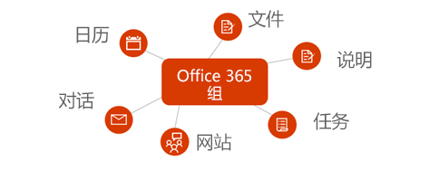
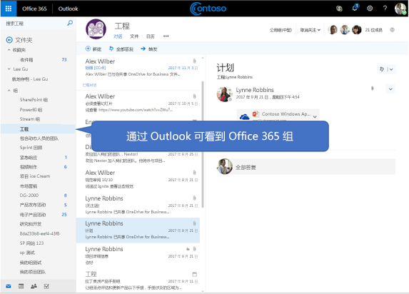

# Microsoft Graph 中的 Office 365 组概述Overview of Office 365 groups in Microsoft Graph

Office 365 组为用户提供了基础成员身份服务，可用于共享会话、文件、备注、日历、计划和许多其他资产。Office 365 groups provide the foundational membership service for users to share conversations, files, notes, calendars, plans, and many other assets. 

## 为何要与 Office 365 组集成？Why integrate with Office 365 groups?   

各个组会形成一个基础，让用户能够跨服务进行协作和集成，以支持任务计划、团队合作、教育等丰富的应用场景。Groups form the foundation that enables user collaboration and integration across services to support rich scenarios in task planning, teamwork, education, and more. 当你与 Office 365 组集成后，随着数百万用户在 Office 365 套件及更高版本中跨各种体验进行转换，你的应用程序即可为他们提供支持。When you integrate with Office 365 groups, your application can support millions of users as they transition across various experiences in the Office 365 suite and beyond.  
 
### 创建组以促进跨服务的团队合作Create groups to facilitate teamwork across services 
 
你可以使用 Microsoft Graph API 在整个协作生命周期中创建、管理或删除组。You can use the Microsoft Graph API to create, manage, or delete groups throughout the lifecycle of collaboration. 例如，可以执行以下操作：For example, you can specify the following:  
 
- 使用[创建组](../api-reference/v1.0/api/group_post_groups.md) API 预配一个新组。Use the [Create group](../api-reference/v1.0/api/group_post_groups.md) API to provision a new group. 然后，该组可用于一系列应用程序，例如 Outlook、SharePoint、Microsoft Teams、Planner，甚至 Microsoft Stream。The group is then made available in a range of applications, such as Outlook, SharePoint, Microsoft Teams, Planner, and even Microsoft Stream. Microsoft Graph 可跨这些连接的服务进行同步，以对所有组成员无缝提供访问权限。Microsoft Graph synchronizes across these connected services to seamlessly provide access to all group members.  
 
    **每个 Office 365 组都与一组默认的 Office 365 服务集成****Every Office 365 group is integrated with a default set of Office 365 services**

      

- 允许成员指示某个组是他们的[收藏夹](../api-reference/v1.0/api/group_addfavorite.md)之一，或者在他们选择时[将其从收藏夹中删除](../api-reference/v1.0/api/group_removefavorite.md)。Enable members to indicate that a group is one of their [favorites](../api-reference/v1.0/api/group_addfavorite.md), or [remove it from their favorites](../api-reference/v1.0/api/group_removefavorite.md) if they choose. 
- 从自定义应用程序中[创建](../api-reference/v1.0/api/group_post_conversations.md)、[获取](../api-reference/v1.0/api/group_get_conversation.md)或[删除](../api-reference/v1.0/api/group_delete_conversation.md)组对话。[Create](../api-reference/v1.0/api/group_post_conversations.md), [get](../api-reference/v1.0/api/group_get_conversation.md), or [delete](../api-reference/v1.0/api/group_delete_conversation.md) group conversations from your custom application. 
- 在组日历上计划日历[事件](../api-reference/v1.0/resources/event.md)。Schedule calendar [events](../api-reference/v1.0/resources/event.md) on the group calendar. 
- 获取与组关联的 [SharePoint 网站](../api-reference/v1.0/resources/site.md)的相关信息，如文档库[列表](../api-reference/v1.0/api/list_list.md)或[子网站](../api-reference/v1.0/api/site_list_subsites.md)。Get information about the [SharePoint site](../api-reference/v1.0/resources/site.md) that's associated with a group, such as the document library [lists](../api-reference/v1.0/api/list_list.md) or [subsites](../api-reference/v1.0/api/site_list_subsites.md). 
- 在 Planner 中[创建一个属于组的计划](../api-reference/v1.0/api/planner_post_buckets.md)。[Create a plan](../api-reference/v1.0/api/planner_post_buckets.md) in Planner that is owned by a group. 该计划通过允许[创建任务](../api-reference/v1.0/api/planner_post_tasks.md)（可以[跨存储桶进行组织](../api-reference/v1.0/api/planner_post_buckets.md)），提供了一种直观的方式来跟踪团队合作。The plan provides a visual way to track teamwork by allowing you to [create tasks](../api-reference/v1.0/api/planner_post_tasks.md) that can be [organized across buckets](../api-reference/v1.0/api/planner_post_buckets.md). 
- 访问与组关联的 [OneNote](../api-reference/v1.0/resources/onenote.md) 笔记本，这可用于收集会议记录和整理想法。Access the [OneNote](../api-reference/v1.0/resources/onenote.md) notebook associated with a group, which can be used for collecting meeting notes and organizing ideas. 
  
    **Outlook 网页中的 Office 365 组和对话****Office 365 groups and conversations in Outlook in the web**

     

- [为 Microsoft Teams 启用组](../api-reference/beta/api/team_put_teams.md)（预览版），以允许组成员参与持久聊天。[Enable a group for Microsoft Teams](../api-reference/beta/api/team_put_teams.md) (preview) to allow group members to engage in persistent chat.  
- [删除组](../api-reference/v1.0/api/group_delete.md)。[Delete groups](../api-reference/v1.0/api/group_delete.md) 删除组时，所有关联的内容也会一并删除，从而防止孤立的站点、对话或计划。When a group is deleted, all associated content is also deleted, which prevents orphaned sites, conversations, or plans. 
 
### 无缝管理组成员身份Manage group membership seamlessly 
 
Office 365 组是共享 Microsoft 服务或你的应用中资源访问权限的用户集合。Groups are collections of users and other principals who share access to resources in Microsoft services or in your app. 由于组成员身份是集中管理的，因此，对成员身份的任何更改都会影响与该组关联的所有服务。Because group membership is managed centrally, any changes to membership affect all services associated with the group. 你可使用 Microsoft Graph 执行以下组成员身份任务：You can use Microsoft Graph to perform the following group membership tasks:
 
- 从现有组中[添加](../api-reference/v1.0/api/group_post_members.md)和[删除](../api-reference/v1.0/api/group_delete_members.md)成员。[Add](../api-reference/v1.0/api/group_post_members.md) and [remove](../api-reference/v1.0/api/group_delete_members.md) members from an existing group. 
- 获取组的[所有者列表](../api-reference/v1.0/api/group_list_owners.md)或[成员列表](../api-reference/v1.0/api/group_list_members.md)。Get a [list of owners](../api-reference/v1.0/api/group_list_owners.md) or a [list of members](../api-reference/v1.0/api/group_list_members.md) for a group. 这有助于传达哪些人员可以访问组内容，或者哪些人员可能需要执行管理职责，如续订组或批准加入请求。This helps communicate who has access to group content, or who might need to perform administrative duties, such as renewing the group or approving a join request. 
- 通过[更新组](../api-reference/v1.0/api/group_update.md)操作，可将组指定为**公开**（其中组内容对同一组织中的任何人都可见），或者**私人**（其中组内容仅对成员可见）。Designate groups as **Public**, where group content is visible to anyone in the same organization, or **Private**, where group content is only visible to members, via the [update group](../api-reference/v1.0/api/group_update.md) operation. 
- 从组所有者列表中[删除不再参与特定组所有权职责的所有者](../api-reference/v1.0/api/group_delete_owners.md)。[Remove owners](../api-reference/v1.0/api/group_delete_owners.md) who are no longer participating in the ownership responsibilities for a particular group from the list of group owners. 
 
### 建立和维护组策略设置Establish and maintain group policy settings 
 
随着组织内创建的组数量开始增长，Microsoft Graph 支持管理组的使用情况和生命周期的能力。As the number of groups created within an organization begins to grow, Microsoft Graph supports the ability to govern the usage and lifecycle of the group. 你可以跨组织中的所有组强制执行组策略。You can enforce group policies across all groups within an organization. 可以使用 Microsoft Graph API 执行以下操作：You can use Microsoft Graph to:

- 配置广泛的[组策略设置](../api-reference/v1.0/resources/groupsetting.md)，从而帮助定义行为，例如，除非所有者续订组并对 Office 365 组强制执行命名策略，否则会自动删除组。Configure a broad range of [group policy settings](../api-reference/v1.0/resources/groupsetting.md) that help define behaviors, such as automatically deleting groups unless they are renewed by an owner and enforcing naming policies on Office 365 groups. 
- [续订](../api-reference/v1.0/api/group_renew.md)即将到期的组，以让团队成员继续协作和访问内容。[Renew](../api-reference/v1.0/api/group_renew.md) groups that are about to expire to allow team members to continue with collaboration and accessing content. 如果未根据已建立的过期策略续订组，则会自动删除该组。If the group is not renewed according to the established expiration policy, the group is automatically deleted. 
- [恢复](../api-reference/v1.0/api/directory_deleteditems_restore.md)已删除的组。[Restore](../api-reference/v1.0/api/directory_deleteditems_restore.md) deleted groups.
 
## 后续步骤Next steps

- 在 [Graph Explorer](https://developer.microsoft.com/zh-CN/graph/graph-explorer) 中尝试一些示例 API 请求。Try out some sample API requests in the [Graph Explorer](https://developer.microsoft.com/zh-CN/graph/graph-explorer). 
- 详细了解如何在 Microsoft Graph 中[使用组 API](../api-reference/v1.0/resources/groups-overview.md)。Learn more about how to [use the groups API](../api-reference/v1.0/resources/groups-overview.md) in Microsoft Graph.
