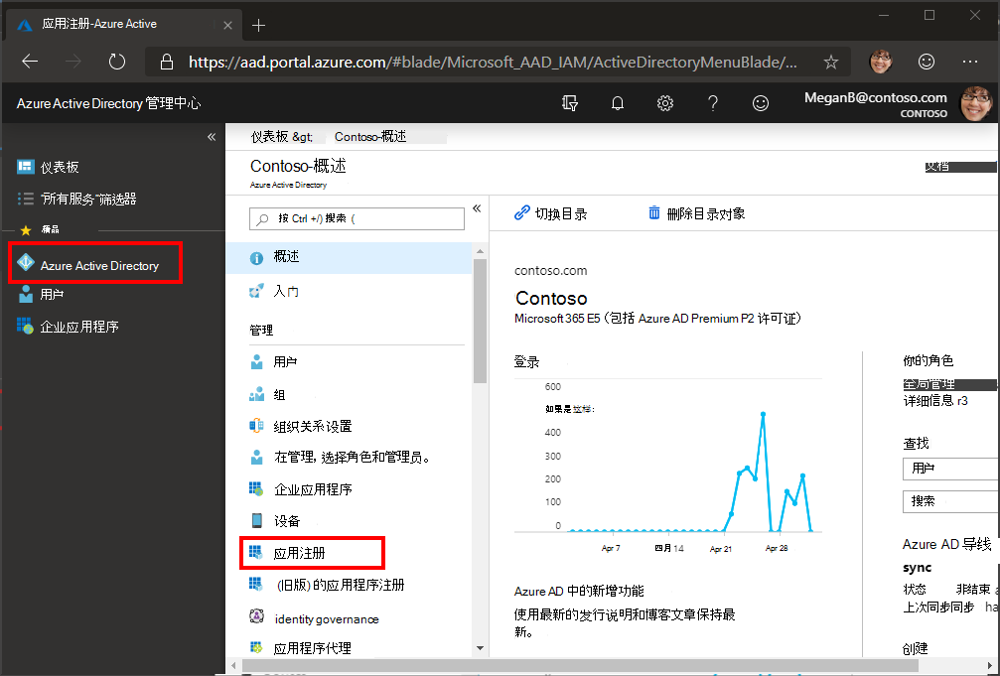
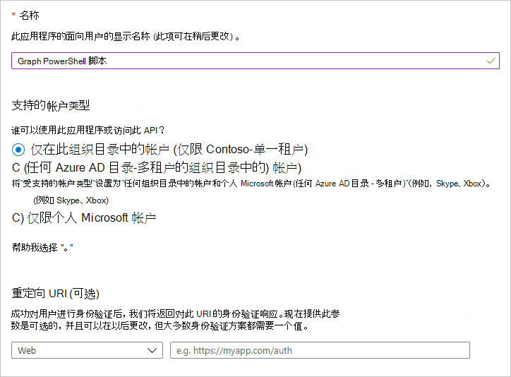

# <a name="use-app-only-authentication-with-the-microsoft-graph-powershell-sdk"></a>对 Microsoft Graph PowerShell SDK 使用仅限应用的身份验证

PowerShell SDK 支持两种类型的身份验证： [委派访问](..\auth-v2-user.md)权限和 [仅限应用访问](..\auth-v2-service.md)。 本指南将重点介绍启用仅限应用访问权限所需的配置。

> [!IMPORTANT]
> 仅限应用访问权限向应用程序直接授予权限，并要求管理员同意所需的权限范围。 有关仅限应用访问权限的详细信息，请参阅 [Microsoft identity platform 和 OAuth 2.0 客户端凭据流](/azure/active-directory/develop/v2-oauth2-client-creds-grant-flow)。

我们来演练如何为简单脚本配置仅应用程序访问权限，以列出 Microsoft 365 租户中的用户和组。

## <a name="configuration"></a>配置

在使用仅限应用访问的 SDK 之前，您需要具备以下各项。

- 证书用作应用程序的凭据。 这可以是自签名证书或来自颁发机构的证书。
- 您必须在 Azure AD 中 [注册应用程序](/azure/active-directory/develop/app-objects-and-service-principals) ，并使用您的方案所需的权限范围进行配置，并共享证书的公钥。

### <a name="certificate"></a>证书

您将需要在将运行脚本的计算机上安装在用户的受信任存储区中的 x.509 证书。 您还需要以 .cer、pem 或 .crt 格式导出的证书公钥。 你将需要证书主题的值。

### <a name="register-the-application"></a>注册应用程序

你可以在 [Azure Active Directory 门户](https://aad.portal.azure.com)中或使用 PowerShell 注册应用程序。

# <a name="portal"></a>[门户](#tab/azure-portal)

1. 打开浏览器并导航到 [Azure Active Directory 管理中心](https://aad.portal.azure.com) ，并使用 Microsoft 365 租户组织管理员登录。

1. 选择左侧导航栏中的“ **Azure Active Directory** ”，再选择“ **管理** ”下的“ **应用注册** ”。

    

1. 选择“新注册”  。 在“注册应用”  页上，按如下方式设置值。

    - 将“名称”  设置为“`Graph PowerShell Script`”。
    - 仅将 **受支持的帐户类型** 设置为 **此组织目录中的帐户** 。
    - 将 **重定向 URI** 保留为空。

    

1. 选择“ **注册** ”。 在 " **图形 PowerShell 脚本** " 页面上，将应用程序的值复制 **(客户端) id** 和 **目录 (租户) id** 并保存它们。

    

1. 选择 " **管理** " 下的 " **API 权限** "。 选择 " **添加权限** "。

1. 依次选择 " **Microsoft Graph** " 和 " **应用程序权限** "。 添加 **用户。 read. all** 和 **Group. all** ，然后选择 " **添加权限** "。

1. 在 **配置的权限** 中，删除委派的 **用户。** 在 **Microsoft Graph** 下，选择权限右侧的 " **...** "，然后选择 " **删除权限** " 来读取权限。 选择 **"是，删除** 以确认"。

1. 选择 " **授予管理员同意 ...** " 按钮，然后选择 **"是"** 授予管理员同意配置的应用程序权限。 " **已配置权限** " 表中的 " **状态** " 列更改为 "已 **授予"。**

    

1. 选择“管理”  下的“证书和密码”  。 选择 " **上传证书** " 按钮。 浏览到证书的公钥文件，然后选择 " **添加** "。

# <a name="powershell"></a>[PowerShell](#tab/powershell)

> [!NOTE]
> 在执行以下步骤之前，您必须已 [安装](installation.md) Microsoft GRAPH PowerShell SDK。

您可能想知道： "我可以使用 PowerShell SDK 注册应用程序，以便我可以使用 PowerShell SDK 吗？" 是的！ 在这种情况下，您使用的是具有委派访问权限的 PowerShell SDK，以管理员身份登录，并创建应用注册。 然后，使用该应用注册，可以将 PowerShell SDK 与仅限应用访问权限一起使用，以允许无人参与的脚本。

1. 使用文本编辑器创建一个名为 **RegisterAppOnly.ps1** 的新文件。 将以下代码粘贴到文件中。

    :::code language="powershell" source="RegisterAppOnly.ps1":::

1. 保存文件。 在包含 **RegisterAppOnly.ps1** 的目录中打开 PowerShell，并运行以下命令。

    ```powershell
    .\RegisterAppOnly.ps1 -AppName "Graph PowerShell Script" -CertPath "PATH_TO_PUBLIC_KEY_FILE"
    ```

1. 根据提示打开浏览器。 使用管理员帐户登录，并接受这些权限。

1. 查看提示的输出 `Please go to the following URL in your browser to provide admin consent` 。 复制提供的 URL 并将其粘贴到浏览器中。 使用管理员帐户登录以授予对新注册应用程序的管理员同意。

    > [!NOTE]
    > 授予管理员同意后，浏览器将显示错误： `AADSTS500113: No reply address is registered for the application` 。 这是因为应用注册不包含重定向 URL。 可以忽略此错误。

1. 查看 PowerShell 输出的其余部分 `Connect-MgGraph` 预填充了您的应用程序注册值的命令。

---

## <a name="authenticate"></a>身份验证

完成上述配置步骤后，您应具有三条信息。

- 上载到 Azure AD 应用注册的证书的证书主题。
- 应用注册的应用程序 ID。
- 你的租户 ID。

让我们使用它们来测试身份验证。 打开 PowerShell 并运行以下命令，将占位符替换为您的信息。

```powershell
Connect-MgGraph -ClientID YOUR_APP_ID -TenantId YOUR_TENANT_ID -CertificateName YOUR_CERT_SUBJECT
```

如果成功，你将看到 "" `Welcome To Microsoft Graph!` 。 运行 `Get-MgContext` 以验证您是否已通过仅限应用进行身份验证。 输出的外观应如下所示。

```powershell
ClientId              : YOUR_APP_ID
TenantId              : YOUR_TENANT_ID
CertificateThumbprint :
Scopes                : {Group.Read.All, User.Read.All}
AuthType              : AppOnly
CertificateName       : YOUR_CERT_SUBJECT
Account               :
AppName               : Graph PowerShell Script
ContextScope          : Process
```

## <a name="create-the-script"></a>创建脚本

创建一个名为 **GraphAppOnly.ps1** 的新文件，并添加以下代码。

```powershell
# Authenticate
Connect-MgGraph -ClientID YOUR_APP_ID -TenantId YOUR_TENANT_ID -CertificateName YOUR_CERT_SUBJECT

Write-Host "USERS:"
Write-Host "======================================================"
# List first 50 users
Get-MgUser -Property "id,displayName" -PageSize 50 | Format-Table DisplayName, Id

Write-Host "GROUPS:"
Write-Host "======================================================"
# List first 50 groups
Get-MgGroup -Property "id,displayName" -PageSize 50 | Format-Table DisplayName, Id

# Disconnect
Disconnect-MgGraph
```

将命令中的占位符替换 `Connect-MgGraph` 为您的信息。 保存该文件，然后在创建该文件的目录中打开 PowerShell。 使用以下命令运行脚本。

```powershell
.\GraphAppOnly.ps1
```

该脚本输出用户和组的列表，该列表类似于 (截断以简化) 的以下输出。

```powershell
Welcome To Microsoft Graph!
USERS:
======================================================

DisplayName              Id
-----------              --
Conf Room Adams          88d1ba68-8ff5-4de2-90ed-768c00abcfae
Adele Vance              3103c7b9-cfe6-4cd3-a696-f88909b9a609
MOD Administrator        da3a885e-2d97-41de-9347-5271ef321b58
...

GROUPS:
======================================================

DisplayName                         Id
-----------                         --
App Development                     06dce3e5-d310-4add-ab2c-be728fb9076e
All Employees                       1a1cd42d-9801-4e9d-9b77-5215886174ef
Mark 8 Project Team                 2bf1b0d0-81f6-4e80-b971-d1db69f8d651
...
```
