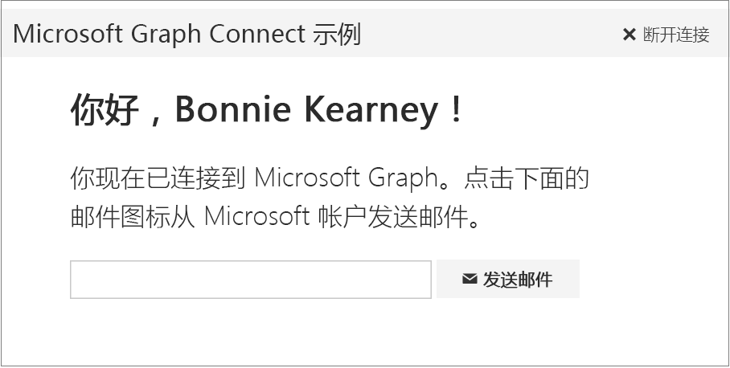

# <a name="get-started-with-microsoft-graph-in-a-ruby-on-rails-app"></a>在 Ruby on Rails 应用中开始使用 Microsoft Graph

本文介绍了从 Azure AD v2.0 终结点获取访问令牌和调用 Microsoft Graph 所需的任务。介绍了生成 [Microsoft Graph Ruby on Rails Connect 示例](https://github.com/microsoftgraph/ruby-connect-rest-sample) 的步骤，并说明使用 Microsoft Graph 要实现的主要概念。本文还介绍了如何使用 REST 直接调用来访问 Microsoft Graph。

若要下载使用 Azure AD 终结点的 Connect 示例版本，请参阅 [Microsoft Graph Ruby on Rails Connect 示例](https://github.com/microsoftgraph/ruby-connect-rest-sample/tree/last_v1_auth)。

下图显示了将要创建的应用。 



**不想生成一个应用吗？** 使用 [Microsoft Graph 快速入门](https://graph.microsoft.io/en-us/getting-started) 快速准备就绪并开始运行，或者下载本文基于的 [Ruby REST Connect 示例](https://github.com/microsoftgraph/ruby-connect-rest-sample)。


## <a name="prerequisites"></a>先决条件

若要开始，将需要以下各项： 

- Ruby 2.1，用于在开发服务器上运行该示例。
- Rails 框架（该示例已经过 Rails 4.2 测试）。
- 捆绑程序依存关系管理器
- 用于 Ruby 的 Rack Web 服务器界面。
- 一个 [Microsoft 帐户](https://www.outlook.com/) 或者一个[工作或学校帐户](https://docs.microsoft.com/en-us/office/developer-program/office-365-developer-program-faq#account-types)
- 适用于 Ruby on Rails 的 Microsoft Graph Connect 初学者项目。下载 [Microsoft Graph Ruby on Rails Connect 示例](https://github.com/microsoftgraph/ruby-connect-rest-sample)。初学者项目位于“初学者”文件夹中。__


## <a name="register-the-application"></a>注册应用程序

在 Microsoft 应用注册门户上注册一个应用。这将生成应用程序 ID 和机密，然后你将用它们配置要进行身份验证的应用。

1. 使用个人或工作或学校帐户登录到 [Microsoft 应用注册门户](https://apps.dev.microsoft.com/)。

2. 选择“**添加应用**”。

3. 输入应用的名称，并选择“**创建应用程序**”。

    将显示注册页，其中列出应用的属性。

4. 复制应用程序 ID。这是应用的唯一标识符。

5. 在“**应用程序机密**”下，选择“**生成新密码**”。从“**生成的新密码**”对话中复制应用机密。

    将使用此应用程序 ID 和应用机密配置应用。

6. 在“平台”**** 下，依次选择“添加平台”**** > “Web”****。

7. 请确保已选中“允许隐式流”**** 复选框，并输入 *http://localhost:3000/auth/microsoft_v2_auth/callback* 作为重定向 URI。

    “允许隐式流”选项启用 OpenID Connect 混合流。在身份验证过程中，这可使应用同时接收登录信息 (id_token) 以及应用用来获取访问令牌的项目（在这种情况下，项目为授权代码）。

    重定向 URI *http://localhost:3000/auth/microsoft_v2_auth/callback* 是 OmniAuth 中间件配置为在处理身份验证请求后使用的值。

8. 选择“保存”****。

## <a name="configure-the-project"></a>配置项目

1. 下载或克隆 [Microsoft Graph Ruby on Rails Connect 示例](https://github.com/microsoftgraph/ruby-connect-rest-sample)。在自己选择的编辑器中打开“_初学者_”文件夹。
1. 如果你还没有捆绑程序和机架，请使用以下命令进行安装。

    ```
    gem install bundler rack
    ```
2. 在 config/environment.rb 文件中执行以下操作：
    - 用所注册应用程序的客户端 ID 替换 *ENTER_YOUR_CLIENT_ID*。
    - 用所注册的应用程序的密钥替换 *ENTER_YOUR_SECRET*。

3. 使用以下命令安装 Rails 应用程序和依存关系。

    ```
    bundle install
    ```

## <a name="authenticate-the-user-and-get-an-access-token"></a>对用户进行身份验证并获取一个访问令牌

此应用使用授权代码授予流和委派用户身份。对于 Web 应用程序，该流需要已注册应用的应用程序 ID、机密和重定向 URL。 

身份验证流可以划分为以下几个基本步骤：

1. 重定向用户以进行身份验证并获得许可
2. 获取授权代码
3. 兑换访问令牌的授权代码

>有关该身份验证流的详细信息，请参阅 Azure AD 文档中的 [Web 应用程序到 Web API](https://azure.microsoft.com/en-us/documentation/articles/active-directory-authentication-scenarios/#web-application-to-web-api) 和 [使用 OpenID Connect 将 Microsoft 身份和 Microsoft Graph 集成到 Web 应用程序中](https://azure.microsoft.com/en-us/documentation/samples/active-directory-dotnet-webapp-openidconnect-v2/)。

我们将使用具有三个 [Rack](http://rack.github.io/) 中间件的堆栈来使应用对 Microsoft Graph 进行身份验证。

- [OmniAuth](https://rubygems.org/gems/omniauth) 用于进行多个提供程序身份验证的通用 Rack 框架。
- [Omniauth-oauth2](https://rubygems.org/gems/omniauth-oauth2) 用于 OmniAuth 的抽象 OAuth2 策略。 
- omniauth-microsoft_v2_auth，一种 OmniAuth 策略，可自定义 Omniauth-oauth2 以专门对 Azure AD v2.0 终结点提供身份验证。此项目包含在代码示例中。

### <a name="specify-gem-dependencies-for-authentication"></a>指定用于身份验证的 gem 依赖项

在 Gemfile 中，取消评论以下 gem 以将其添加为依赖项。

    ```
    gem 'omniauth'
    gem 'omniauth-oauth2'
    gem 'omniauth-microsoft_v2_auth', path: './omniauth-microsoft_v2_auth'
    ```

注意 `omniauth-microsoft_v2_auth` 包含在应用项目中，并且会通过指定的路径进行安装。 

### <a name="configure-the-authentication-middleware"></a>配置身份验证中间件

在 `config/initializers/omniauth-microsoft_v2_auth.rb` 中，取消评论下列行。

    ```
    Rails.application.config.middleware.use OmniAuth::Builder do
      provider :microsoft_v2_auth,
      ENV['CLIENT_ID'],
      ENV['CLIENT_SECRET'],
      :scope => ENV['SCOPE']
    end
    ```
这将配置 OmniAuth 中间件，其中包括指定要使用的应用程序 ID 和应用机密及用户要请求的范围。以下是之前在 `config/environment.rb` 指定的值。

### <a name="specify-routes-for-authentication"></a>指定身份验证的路由

现在我们需要指定身份验证流必需的两个路由。第一个路由将身份验证请求转发至 OmniAuth 中间件，第二个路由指定发生身份验证后 OmniAuth 应在应用中重定向到的位置。

在 `config/routes.rb` 中，取消评论以下理由指令。

    get '/login', to: 'pages#login'

这会将登录请求定向到页面控制器的 `login` 方法，该方法会将请求重定向至 omniauth-microsoft_v2_auth 中间件。

    def login
        redirect_to '/auth/microsoft_v2_auth'
    end

接下来，我们需要指定发生身份验证后 OmniAuth 应在应用中重定向到的位置。取消评论以下路由。

    match '/auth/:provider/callback', to: 'pages#callback', via: [:get, :post]

在 OmniAuth 完成对用户的身份验证后，会调用应用注册中指定的重定向 URL；在此示例中为 *http://localhost:3000/auth/microsoft_v2_auth/callback*。 上述路由模式与该 URL 匹配，因此，会将请求路由至页面控制器的 `callback` 方法。

### <a name="get-an-access-token"></a>获取访问令牌

接下来，我们将添加在用户成功登录后实际启动身份验证进程和检索访问令牌的代码。

请查看 `app/views/pages/index.html.erb`，网站根目录视图。视图包括可允许用户登录的单个按钮。

    <button class="ms-Button" onclick="window.location.href = '/login'">
        <span class="ms-Button-label"><%= t('connect_button') %></span>
    </button>

如上所示，登录方法重定向至已配置应用程序 ID 和应用机密及用户要请求的范围的 OmniAuth 中间件。用户成功完成身份验证后，OmniAuth 将带有访问令牌和其他用户信息的哈希返回至应用。

现在可以添加代码来处理 OmniAuth 回叫，并通过该哈希检索信息。 

在 `app/controllers/pages_controller.rb` 中，用以下代码替换空的 `callback` 方法。

    ```
    def callback
        # Access the authentication hash for omniauth
        # and extract the auth token, user name, and email
        data = request.env['omniauth.auth']
    
        @email = data[:extra][:raw_info][:userPrincipalName]
        @name = data[:extra][:raw_info][:displayName]

        # Associate token/user values to the session
        session[:access_token] = data['credentials']['token']
        session[:name] = @name
        session[:email] = @email
        
        # Debug logging
        logger.info "Name: #{@name}"
        logger.info "Email: #{@email}"
        logger.info "[callback] - Access token: #{session[:access_token]}"
    end

    ```

该方法会检索身份验证哈希，然后存储当前会话中的访问令牌、用户名和电子邮件。

> **注意：** 本项目中的简单身份验证和令牌处理操作仅用于说明目的。在生产应用中，可能会构建更为可靠的方法来处理身份验证，其中包括安全令牌处理和令牌刷新。

## <a name="call-microsoft-graph"></a>调用 Microsoft Graph

现在可以添加代码调用 Microsoft Graph。 

由 `callback` 方法 (`app/views/pages/callback.html.erb`) 呈现的视图包含带有单一按钮的简单窗体。该窗体会发布到 `send_mail`，并且其中包含单一参数、预设收件人的电子邮件地址。
    
    ``` 
    <form action="../../send_mail" method="post">
      <div class="ms-Grid-col ms-u-mdPush1 ms-u-md9 ms-u-lgPush1 ms-u-lg6">
        ...
            <div class="ms-TextField">
               <input class="ms-TextField-field" name="specified_email" value="<%= @email %>">
            </div>
            <button class="ms-Button">
            <span class="ms-Button-label"><i class="ms-Icon ms-Icon--mail" aria-hidden="true"></i><%= t('send_mail_button') %></span>
            </button> 
        ...
    ```

在 `app/controllers/pages_controller.rb` 中，用以下代码替换空的 `send_mail` 方法。

    ```
    def send_mail
        logger.debug "[send_mail] - Access token: #{session[:access_token]}"
        
        # Used in the template
        @name = session[:name]
        @email = params[:specified_email]
        @recipient = params[:specified_email]
        @mail_sent = false
        
        send_mail_endpoint = URI("#{GRAPH_RESOURCE}#{SENDMAIL_ENDPOINT}")
        content_type = CONTENT_TYPE
        http = Net::HTTP.new(send_mail_endpoint.host, send_mail_endpoint.port)
        http.use_ssl = true
        
        # If you want to use a sniffer tool, like Fiddler, to see the request
        # you might need to add this line to tell the engine not to verify the
        # certificate or you might see a "certificate verify failed" error
        # http.verify_mode = OpenSSL::SSL::VERIFY_NONE
        
        email_body = File.read('app/assets/MailTemplate.html')
        email_body.sub! '{given_name}', @name
        email_subject = t('email_subject')
        
        logger.debug email_body
    
        email_message = "{
            Message: {
            Subject: '#{email_subject}',
            Body: {
                ContentType: 'HTML',
                Content: '#{email_body}'
            },
            ToRecipients: [
                {
                    EmailAddress: {
                        Address: '#{@recipient}'
                    }
                }
            ]
            },
            SaveToSentItems: true
            }"
            
        response = http.post(
            SENDMAIL_ENDPOINT,
            email_message,
            'Authorization' => "Bearer #{session[:access_token]}",
            'Content-Type' => content_type
        )
        
        logger.debug "Code: #{response.code}"
        logger.debug "Message: #{response.message}"
        
        # The send mail endpoint returns a 202 - Accepted code on success
        if response.code == '202'
            @mail_sent = true
        else
            @mail_sent = false
            flash[:httpError] = "#{response.code} - #{response.message}"
        end
        
        render 'callback'
    end
    ```

该代码会构建 HTTP 请求，设置电子邮件的格式，然后调用 Microsoft Graph 发送电子邮件。

若要创建电子邮件，代码会通过窗体传递的参数中的会话令牌和收件人电子邮件地址拉取用户名。然后代码会在项目所包含的模板中读取电子邮件正文，插入用户名和电子邮件地址，并将电子邮件文本附加为 HTTP 请求正文。

若要发送电子邮件，代码会构建 HTTP 请求，将访问令牌附加为授权标头，然后将请求发布至发送电子邮件终结点。

最后，代码会使用返回的 HTTP 响应代码来通知用户电子邮件是否发送成功。

## <a name="run-the-app"></a>运行应用

1. 使用以下命令安装 Rails 应用程序和依存关系。

    ```
    bundle install
    ```
2. 要启动 Rails 应用程序，请键入以下命令。

    ```
    rackup -p 3000
    ```
3. 转到 Web 浏览器中的 `http://localhost:3000`。

## <a name="see-also"></a>另请参阅
- 使用 [Graph 浏览器](https://developer.microsoft.com/graph/graph-explorer)试用 REST API。
- 在 GitHub 上了解我们的其他 [Microsoft Graph 示例](https://github.com/microsoftgraph)。


