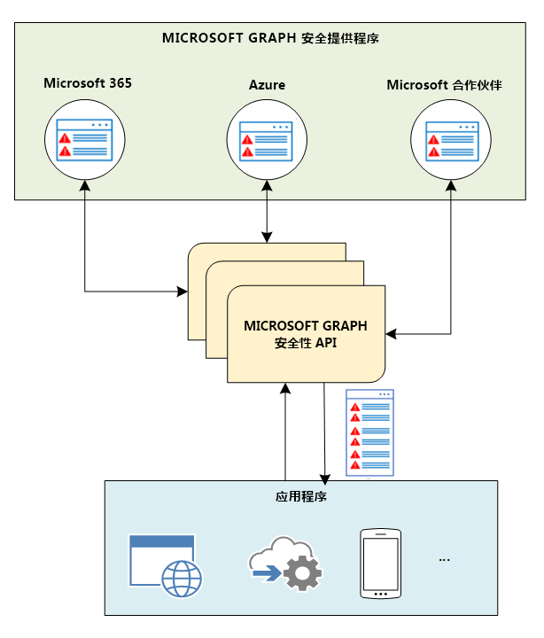

# Microsoft Graph 安全性 API 概述Microsoft Graph Security API overview

Microsoft Graph 安全性 API 可用于连接 Microsoft 安全产品、服务和合作伙伴，以简化安全操作并改进威胁防护、检测和响应功能。You can use the Microsoft Graph Security API to connect Microsoft security products, services, and partners to streamline security operations and improve threat protection, detection, and response capabilities. 作为中介服务（或代理），Microsoft Graph 安全性 API 提供了一个编程接口，用于连接多个 [Microsoft Graph 安全提供程序](/graph/api/resources/securityvendorinformation?view=graph-rest-1.0)（亦称为“安全提供程序”或“提供程序”）。The Microsoft Graph Security API is an intermediary service (or broker) that provides a single programmatic interface to connect multiple [Microsoft Graph Security providers](/graph/api/resources/securityvendorinformation?view=graph-rest-1.0) (also called security providers or providers). 向 Microsoft Graph 安全性 API 发出的请求被联合到所有适用的安全提供程序。Requests to the Microsoft Graph Security API are federated to all applicable security providers. 结果以通用架构的形式聚合并返回到发出请求的应用，如下图所示。The results are aggregated and returned to the requesting application in a common schema, as shown in the following diagram. 有关详细信息，请参阅 [Microsoft Graph 安全性 API 数据流](security-dataflow.md)。For details, see [Microsoft Graph Security API data flow](security-dataflow.md).

若要了解授权，请参阅[授权和 Microsoft Graph 安全性 API](security-authorization.md)。For information about authorization, see [Authorization and the Microsoft Graph Security API](security-authorization.md). 若要了解委托的权限和应用权限等权限，请参阅[权限](permissions-reference.md#security-permissions)。For information about permissions, including delegated and application permissions, see [Permissions](permissions-reference.md#security-permissions).

## 为什么要使用 Microsoft Graph 安全性 API？Why use the Microsoft Graph Security API?

使用 [Microsoft Graph 安全性 API](/graph/api/resources/security-api-overview?view=graph-rest-1.0)，可以轻松连接各个 Microsoft 和 Microsoft 合作伙伴安全产品和服务。The [Microsoft Graph Security API](/graph/api/resources/security-api-overview?view=graph-rest-1.0) makes it easy to connect with different Microsoft and Microsoft partner security products and services. 借助它，可以更容易地实现并丰富这些解决方案的价值。It allows you to more readily realize and enrich the value of these solutions.

### 统一和标准化警报跟踪Unify and standardize alert tracking

编写一次代码，即可集成来自任何已集成 Microsoft Graph 的安全解决方案的警报，并跨所有解决方案同步警报状态和分配。Write code once to integrate alerts from any Microsoft Graph-integrated security solution and keep alert status and assignments in sync across all solutions. 还可以通过 [Azure Monitor](https://docs.microsoft.com/zh-CN/azure/monitoring-and-diagnostics/monitor-stream-monitoring-data-event-hubs#what-can-i-do-with-the-monitoring-data-being-sent-to-my-event-hub) 将警报流式处理到安全信息和事件管理 (SIEM) 解决方案（如 Splunk 和 IBM QRadar）。You can also stream alerts to security information and event management (SIEM) solutions, such as Splunk and IBM QRadar, via [Azure Monitor](https://docs.microsoft.com/zh-CN/azure/monitoring-and-diagnostics/monitor-stream-monitoring-data-event-hubs#what-can-i-do-with-the-monitoring-data-being-sent-to-my-event-hub). 若要详细了解 SIEM 与安全性 API 实体的集成，请参阅[与 SIEM 集成](security-siemintegration.md)。For details about SIEM integration with the security API entities, see [Integrate with a SIEM](security-siemintegration.md).

### 关联安全警报以改进威胁防护和响应Correlate security alerts to improve threat protection and response

使用统一警报架构，可以更轻松地跨安全解决方案关联警报。Correlate alerts across security solutions more easily with a unified alert schema. 这样一来，不仅能够接收可操作警报信息，还便于安全分析员使用资产和用户信息来透视和丰富警报，从而更快地响应威胁防护和资产保护。This not only allows you to receive actionable alert information but allows security analysts to pivot and enrich alerts with asset and user information, enabling faster response to threats and asset protection.  

### 更新警报标记、状态和分配Update alert tags, status, and assignments

标记使用其他上下文或威胁情报发出警报，通知响应和修复。Tag alerts with additional context or threat intelligence to inform response and remediation. 确保捕获有关警报的评论和反馈，实现所有工作流程的可见性。Ensure that comments and feedback on alerts are captured for visibility to all workflows. 保持警报状态和分配同步，使所有集成解决方案都能反映当前状态。Keep alert status and assignments in sync so that all integrated solutions reflect the current state. 使用 Webhook 订阅获取变更通知。Use webhook subscriptions to get notified of changes.  

### 解锁安全性上下文以推动调查Unlock security context to drive investigation

深入到相关的安全相关库存（如用户、主机和应用），然后添加来自其他 Microsoft Graph 提供程序（Azure AD、Microsoft Intune、Office 365）的组织上下文，以将业务和安全性上下文结合在一起并改进威胁响应。Dive deep into related security-relevant inventory (like users, hosts, and apps), then add organizational context from other Microsoft Graph providers (Azure AD, Microsoft Intune, Office 365) to bring business and security contexts together and improve threat response.

### 主动管理安全风险（预览版）Proactively manage security risks (preview)

使用 Microsoft 安全功能分数（预览版）了解组织的安全需求，获取改进方法建议，并预测在采纳这些建议后的改进分数。Use the Microsoft Secure Score (preview) to provide visibility into your organization’s security needs and get suggestions for how to improve it, and project an improved score after those suggestions are incorporated. 可以轻松度量一段时间内的进度，并获取有助于提高分数的具体变更的相关见解。Easily measure your progress over time and get insights on specific changes that led to improvement in your score.

## 使用 Microsoft Graph 安全性 API 的优势Benefits of using the Microsoft Graph Security API

下表列出了各种安全解决方案与 Microsoft Graph 安全性 API 集成后获得的优势。The following table lists the benefits that different security solutions can access by integrating with the Microsoft Graph Security API.  

|**区域****Area**     | **优势****Benefits**|
|:---------------|:---------|
|**托管安全服务提供程序 (MSSP)****Managed Security Service Providers (MSSPs)**|<ul><li>简化了与安全操作工具和服务集成的过程。Streamlined integration with security operations tools and services.</li> <li>缩减了部署和维护时间及工作量。Reduced deployment and maintenance time and efforts.</li> <li>能够为 MSSP 客户增值。Ability to deliver more value to MSSP customers.</li></ul>|
|**SIEM 和 IT 风险管理解决方案****SIEM and IT Risk management solutions**|<ul><li>与 Microsoft 安全解决方案和生态系统合作伙伴顺畅集成。Smooth integration with Microsoft security solutions and ecosystem partners.</li> <li>丰富的警报元数据。Rich alert metadata.</li> <li>提升了警报关联性。Better alert correlation.</li></ul>|
|**应用****Applications**  （威胁智能、移动、云、IOT、欺诈检测、标识和访问、风险和合规性、防火墙等）(Threat Intelligence, Mobile, Cloud, IOT, Fraud detection, Identity & Access, Risk & Compliance, Firewall, and so on)|<ul><li>跨各种安全解决方案统一了威胁管理、防护和风险管理。Unified threat management, prevention, and risk management across various security solutions.</li> <li>通过 Microsoft Graph 公开了警报、清单、配置和操作。Alerts, inventory, config, and actions exposed through Microsoft Graph.</li> <li>与已启用 Microsoft Graph 的解决方案即时集成。Instant integration with Microsoft Graph-enabled solutions.</li></ul>|

## API 参考API reference
在查找此服务的 API 参考？Looking for the API reference for this service?

- [Microsoft Graph v1.0 中的安全性 APISecurity API in Microsoft Graph v1.0](/graph/api/resources/security-api-overview?view=graph-rest-1.0)
- [Microsoft Graph beta 中的安全性 APISecurity API in Microsoft Graph beta](/graph/api/resources/security-api-overview?view=graph-rest-beta)

## 后续步骤Next steps

- [使用 Microsoft Graph 安全性 APIUse the Microsoft Graph Security API](/graph/api/resources/security-api-overview?view=graph-rest-1.0)
- 想要成为安全提供程序？Interested in becoming a security provider? 请联系 [graphsecfeedback](mailto:graphsecfeedback@microsoft.com)。Reach out to [graphsecfeedback](mailto:graphsecfeedback@microsoft.com).
