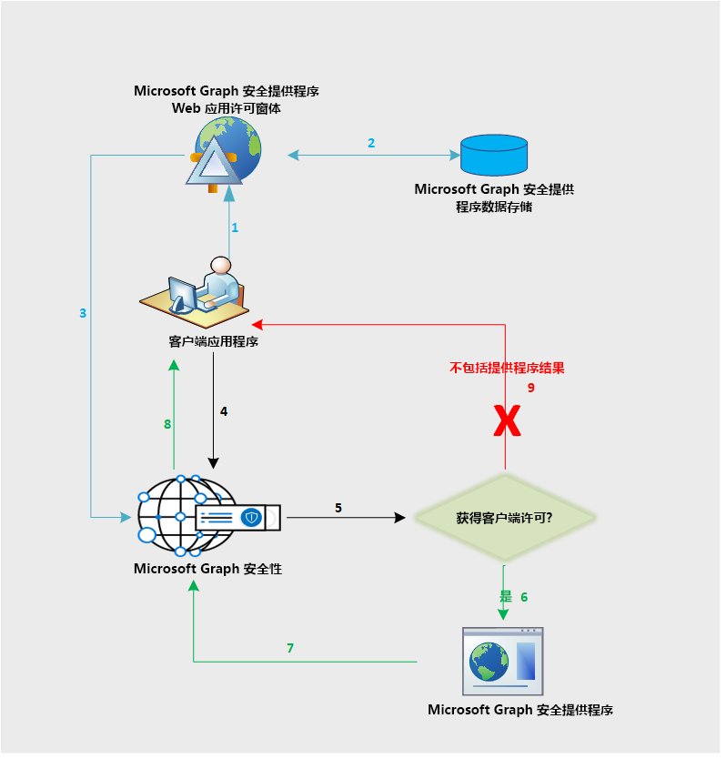

# Microsoft Graph 安全性 API 数据流Microsoft Graph Security API data flow

Microsoft Graph 安全性 API 在 Microsoft Graph 安全性生态系统中联合了对所有提供商的请求。The Microsoft Graph Security API federates requests to all providers in the Microsoft Graph Security ecosystem. 这基于应用程序提供的安全性提供商许可，如下图所示。This is based on the security provider consent provided by the application, as shown in the following diagram. 此许可工作流仅适用于非 Microsoft 提供商。The consent workflow only applies to non-Microsoft providers.

以下是对此流的说明：The following is a description of the flow:

1. 应用程序用户登录到提供商应用程序，以查看提供商提供的许可表单。The application user signs in to the provider application to view the consent form from the provider. 此许可表单体验或 UI 的所有权属于提供商，且仅适用于非 Microsoft 提供商用于获取其客户对向 Microsoft Graph 安全性 API 发送请求的明确许可。This consent form experience or UI is owned by the provider and applies to non-Microsoft providers only to get explicit consent from their customers to send requests to Microsoft Graph Security API.
2. 客户端许可存储在提供商端。The client consent is stored on the provider side.
3. 提供商许可服务调用 Microsoft Graph 安全性 API，来告知相应客户的许可批准。The provider consent service calls the Microsoft Graph Security API to inform consent approval for the respective customer.
4. 应用程序向 Microsoft Graph 安全性 API 发送请求。The application sends a request to the Microsoft Graph Security API.
5. Microsoft Graph 安全性 API 查看此客户映射到各个提供商的许可信息。The Microsoft Graph Security API checks for the consent information for this customer mapped to various providers.
6. Microsoft Graph 安全性 API 调用此客户已通过提供商许可体验明确许可的所有提供商。The Microsoft Graph Security API calls all those providers the customer has given explicit consent to via the provider consent experience.
7. 从该客户端的所有已许可的提供商返回响应。The response is returned from all the consented providers for that client.
8. 结果集响应返回至应用程序。The result set response is returned to the application.
9. 若客户尚未许可任何提供商，则响应不包括任何提供商提供的结果。If the customer has not consented to any provider, no results from those providers are included in the response.
