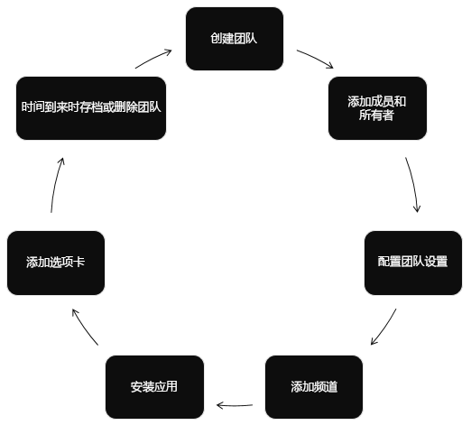

# Microsoft 团队 API 概述

[Microsoft 团队](https://products.office.com/microsoft-teams)是团队协作和智能通信的 ultimate 中心。 基于与 120 多万用户强度和[Office 365](https://products.office.com/)的小数，Microsoft 团队提供了基于聊天协作、 会议、 电话和企业语音功能。

## 为什么与 Microsoft Teams 集成？

### 自动化团队生命周期

用于 Microsoft Graph[创建新的虚拟团队](/graph/api/team-put-teams?view=graph-rest-1.0)时出现的新的业务问题，将向团队，[添加适当的人员](/graph/api/group-post-members?view=graph-rest-1.0)和配置团队[通道](/graph/api/channel-post?view=graph-rest-1.0)、[选项卡](/graph/api/teamstab-add?view=graph-rest-1.0)和[应用程序](/graph/api/teamsappinstallation-add?view=graph-rest-1.0)。
如果您想要获取新团队一起以讨论业务问题、 团队日历[添加新事件](/graph/api/group-post-events?view=graph-rest-1.0)。

当业务问题解决且不再需要团队时，使用 Microsoft 团队 API 对[存档](/graph/api/team-archive?view=graph-rest-1.0)或[删除](/graph/api/group-delete?view=graph-rest-1.0)工作组。 如果您知道团队的最大持续时间创建它时，，设置[Office 365 组过期策略](https://support.office.com/en-us/article/office-365-group-expiration-policy-8d253fe5-0e09-4b3c-8b5e-f48def064733?ui=en-US&rs=en-US&ad=US)会自动删除策略根据团队团队。

### 即使没有围绕完成工作

使用[应用程序权限](permissions-reference.md)来处理[工作组](/graph/api/resources/team?view=graph-rest-1.0)、[通道](/graph/api/resources/channel?view=graph-rest-1.0)和[选项卡](/graph/api/resources/teamstab?view=graph-rest-1.0)不需要人工干预。 您的客户文件订单时，请创建新的通道。
自动学校年的开始处创建类的团队，并将它们存档末尾。

### 创建链接到您的应用程序的团队

让客户创建新的[工作组](/graph/api/resources/team?view=graph-rest-1.0)和[频道](/graph/api/resources/channel?view=graph-rest-1.0)。 
[安装](/graph/api/teamsappinstallation-add?view=graph-rest-1.0)您的[团队应用程序](https://docs.microsoft.com/en-us/microsoftteams/platform/#pivot=home&panel=home-all)中新的团队。 
[Pin 您为选项卡上的应用程序](/graph/api/teamstab-add?view=graph-rest-1.0)中新的通道。 
链接到您的网站的通道[发送消息](/graph/api/channel-post-chatthreads?view=graph-rest-beta)。

### 创建和管理多个团队和频道

Microsoft Graph 便于来创建大量团队和填充它们与用户和通道，通过自动化创建和管理[工作组](/graph/api/resources/team?view=graph-rest-1.0)、[通道](/graph/api/resources/channel?view=graph-rest-1.0)、[选项卡](/graph/api/resources/teamstab?view=graph-rest-1.0)和[应用程序](/graph/api/resources/teamsapp?view=graph-rest-1.0)。
Microsoft Graph 还可以[查找](teams-list-all-teams.md)和[归档](/graph/api/team-archive?view=graph-rest-1.0)您不再使用的团队。 这是相同的 API 上构建的[Microsoft 团队 Admin Center](https://docs.microsoft.com/en-us/microsoftteams/enable-features-office-365)和[团队 PowerShell commandlet](https://docs.microsoft.com/en-us/microsoftteams/teams-powershell-overview)的。

### 向工作组中部署的应用程序

[列出您的租户中的小组](teams-list-all-teams.md)，并为其[安装应用程序](/graph/api/teamsappinstallation-add?view=graph-rest-1.0)。 
[创建选项卡](/graph/api/teamstab-add?view=graph-rest-1.0)通道中使用户可以轻松访问应用程序。

### 在任何类型的应用中使用 Microsoft Graph

Microsoft 团队应用程序提供工作组进行协作效率更高并且引人注目体验的新工具。 让工作组用户这些应用程序共享资产、 聊天，通过进行交互和团队日历上安排事件。 创建团队、 通道和增强的 Microsoft 团队值的对话，还可以自动进行这些应用程序。

您可以创建网站、 服务和本机平台运行的应用程序体验之外的 Microsoft 团队用户，并调用团队 API 以自动执行团队方案。

**为 Microsoft Teams 启用的应用类型**

这些协作工具包括 Microsoft Graph 启用选项卡或自动程序的 Microsoft 团队应用程序内运行。 此外，还可以在 Microsoft Teams 应用以外调用 Microsoft Graph，如从网站或者 Web 服务进行调用。 如果您已为 Microsoft Graph 启用您的网站，可以使用[的 Microsoft 团队开发人员平台](https://docs.microsoft.com/en-us/microsoftteams/platform/#pivot=home&panel=home-all)来[创建选项卡](https://docs.microsoft.com/en-us/microsoftteams/platform/concepts/tabs/tabs-overview)使用现有网站的代码的 Microsoft 团队使用的工作。

Microsoft 团队 Api 可以增强内部和外部团队的应用程序：

|应用类型|方案描述|
|:-------|:-------------------|
| [选项卡](https://docs.microsoft.com/en-us/microsoftteams/platform/concepts/tabs/tabs-overview) |公开您的 Microsoft 团队中的内容。|
| [机器人](https://docs.microsoft.com/en-us/microsoftteams/platform/concepts/bots/bots-overview) |帮助用户在对话中完成任务。|
| [连接器](https://docs.microsoft.com/en-us/microsoftteams/platform/concepts/connectors/connectors) |向频道从外部服务发布更新。|
| [可操作消息](https://docs.microsoft.com/en-us/microsoftteams/platform/concepts/cards/cards) |将增强交互添加到连接器卡。|
| [消息扩展](https://docs.microsoft.com/en-us/microsoftteams/platform/concepts/messaging-extensions) |允许用户查询和共享对话中的信息。|
|网站| 网页中的表面增强内容。|
|服务|通过 Web 服务使用 Microsoft Graph 数据增强客户端应用程序。|
| [活动源](https://docs.microsoft.com/en-us/microsoftteams/platform/concepts/activity-feed)|通过源通知吸引用户。|
| [呼叫和联机会议 （预览）](/graph/api/resources/calls-api-overview?view=graph-rest-beta) |创建自动程序可启动和参与音频/视频呼叫、 路由/传输基于互动语音响应 (IVR) 流的呼叫和参加联机会议的 Microsoft 团队应用程序。|

## API 参考

正在寻找此服务的 API 参考？

请参阅[工作组在 Microsoft Graph 中的 API](/graph/api/resources/teams-api-overview?view=graph-rest-1.0)。

## 后续步骤

- 观看[视频的概述](http://aka.ms/teamsgraph/v1/video)。
- 了解如何[使用 Microsoft Teams API](/graph/api/resources/teams-api-overview?view=graph-rest-1.0)。
- 深入了解[团队](/graph/api/resources/team?view=graph-rest-1.0)、[渠道](/graph/api/resources/channel?view=graph-rest-1.0)和[组](/graph/api/resources/group?view=graph-rest-1.0)资源的方法、属性和关系。
- 尝试 [Graph 浏览器](https://developer.microsoft.com/graph/graph-explorer)中的 API。
- 阅读更多有关 [Microsoft Teams 编程模型](https://docs.microsoft.com/en-us/microsoftteams/platform/concepts/concepts-overview)的信息。
- 研究[呼叫和联机会议 Api](/graph/api/resources/calls-api-overview?view=graph-rest-beta)。
- 获取快速开始与代码示例： [Contoso 航空公司](https://github.com/microsoftgraph/contoso-airlines-teams-sample)、 [C# 浮动示例](https://github.com/microsoftgraph/csharp-teams-sample-graph)
