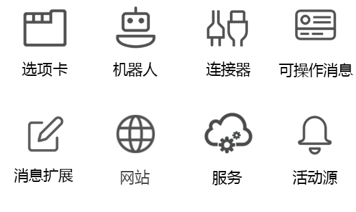

# Microsoft Teams 团队合作 API 概述Microsoft Teams teamwork API overview

Microsoft Teams 是团队合作和智能通信的终极中心。Microsoft Teams is the ultimate hub for teamwork and intelligent communications. Microsoft Teams 基于 Office 365 超过 1.2 亿用户的实力和规模，提供了基于聊天的协作、会议、通话和企业语音功能。Built on the strength and scale of Office 365 with over 120 million users, Microsoft Teams delivers chat-based collaboration, meetings, calling, and enterprise voice features.

## 为什么与 Microsoft Teams 集成？Why integrate with Microsoft Teams?

与 Microsoft Teams 集成，可使你轻松构建自己的服务和应用，覆盖数百万的企业用户，并帮助人们协同工作。Integrating with Microsoft Teams makes it easy for you to build your own services and apps, reaching millions of enterprise users and helping people get work done together. 你可以使用 Microsoft Graph 来创建和管理团队、渠道、消息等。You can use Microsoft Graph to create and manage teams, channels, messages, and more.

### 在任何类型的应用中使用 Microsoft GraphUse Microsoft Graph in any kind of app

在 Microsoft Graph 上构建的 Microsoft Teams 应用为工作小组提供了一种新的工具，使协作成为一种更高效、更具吸引力的体验。Microsoft Teams apps built on Microsoft Graph give work groups a new tool to make collaboration a more productive and compelling experience. 使用 Microsoft Teams，工作组用户可共享资产、通过聊天进行交互，并在团队日历上安排事件。Using Microsoft Teams, work group users share assets, interact through chat, and schedule events on the team calendar. 通过基于 Microsoft Teams API 的应用添加团队、渠道和会话自动化，从而提高 Microsoft Teams 的价值。Enhance the value of Microsoft Teams by adding team, channel, and conversation automation via apps based on the Microsoft Teams API.

网站、服务和本机平台应用程序不在 Microsoft Teams 用户体验中运行，但可用于调用 Microsoft Teams API 来支持 Microsoft Teams 自动化方案。Websites, services, and native platform applications are not run within the Microsoft Teams user experience but can be used to call the Microsoft Teams APIs that enable Microsoft Teams automation scenarios.

**为 Microsoft Teams 启用的应用类型****Types of apps enabled for Microsoft Teams**

这些协作工具包括启用了 Microsoft Graph 的选项卡或在 Microsoft Teams 内运行的机器人应用。These collaboration tools include Microsoft Graph-enabled tab or bot apps running inside Microsoft Teams. 此外，还可以在 Microsoft Teams 应用以外调用 Microsoft Graph，如从网站或者 Web 服务进行调用。You can also call Microsoft Graph outside of a Microsoft Teams app, such as from a website or a web service. 如果已为 Microsoft Graph 启用网站，则可以通过使用 [Microsoft Teams 开发者平台](https://docs.microsoft.com/zh-CN/microsoftteams/platform/#pivot=home&panel=home-all)创建使用现有网站代码的选项卡应用，将此项工作用于 Microsoft Teams。If you've already enabled your website for Microsoft Graph, you can use that work for Microsoft Teams by using the [Microsoft Teams developer platform](https://docs.microsoft.com/zh-CN/microsoftteams/platform/#pivot=home&panel=home-all) to create a tab app that uses the existing website code.

如果 Microsoft Teams 选项卡或机器人应用不是完成指定方案的理想方式，请选择以下应用类型之一。If a Microsoft Teams tab or bot app is not the ideal way to complete your scenario, choose one of the following app types.

|应用类型App type|方案描述Scenario description|
|:-------|:-------------------|
|选项卡Tabs|Microsoft Teams 中的表面增强内容。Surface enhanced content within Microsoft Teams.|
|连接器Connectors|向渠道发布增强的更新。Post enhanced updates to channels.|
|可操作消息Actionable messaging|将增强交互添加到连接器卡。Add enhanced interaction to your connector cards.|
|网站Websites|网页中的表面增强内容。Surface enhanced content in your web pages.|
|机器人Bots|帮助用户在对话中完成任务。Help users get tasks done in conversations.|
|活动源activity feed|通过源通知吸引用户。Engage users via feed notifications.|
|消息扩展Messaging extensions|允许用户查询和共享对话中的增强卡。Allow users to query and share enhanced cards in conversations.|
|服务/Services|通过 Web 服务使用 Microsoft Graph 数据增强客户端应用程序。Enhance your client applications with Microsoft Graph data via your web service.|

### 创建多个团队和渠道Create multiple teams and channels

允许客户创建链接到应用的新[团队](../api-reference/beta/resources/team.md)和[渠道](../api-reference/beta/resources/channel.md)。Allow your customers to create new [teams](../api-reference/beta/resources/team.md) and [channels](../api-reference/beta/resources/channel.md) linked to your app. 通过使用 Microsoft Teams API，可以创建大量团队并使用户和渠道轻松填充它们。Make creating large numbers of teams and populating them with users and channels easy by using the Microsoft Teams API.

### 自动化团队生命周期Automate team lifecycles

当出现新的业务问题时，使用 Microsoft Graph 创建一个新的虚拟团队，用合适的人员[填充团队](../api-reference/v1.0/api/group_post_members.md)，并使用渠道配置团队。Use Microsoft Graph to create a new virtual team when a new business issue arises, [populate the team](../api-reference/v1.0/api/group_post_members.md) with the right people, and configure the team with channels. 若要围绕新业务问题进行一次团队渠道讨论，你可以使用新的对话线程来播种该渠道，以便向新团队成员发布欢迎消息。To start a team channel discussion around the new business issue, you can seed the channel with a new conversation thread to post a welcome message to new team members. 如果想要让新团队一起讨论业务问题，请在团队日历中添加一个新事件，然后邀请团队成员参与事件。If you want to get the new team together to discuss the business issue, add a new event to the team calendar and then invite the members of the team to the event.

当业务问题得到解决并不再需要虚拟团队时，可使用 Microsoft Teams API 来解散团队。When the business issue is resolved and you no longer need the virtual team, use the Microsoft Teams API to tear down the team. 如果在创建虚拟团队时已了解虚拟团队的最长持续时间，则可为团队设置 [Office 365 组过期策略](https://support.office.com/en-us/article/office-365-group-expiration-policy-8d253fe5-0e09-4b3c-8b5e-f48def064733?ui=en-US&rs=en-US&ad=US)，以便根据该策略自动删除团队。If you know the maximum duration of the virtual team when you create it, set an [Office 365 group expiration policy](https://support.office.com/en-us/article/office-365-group-expiration-policy-8d253fe5-0e09-4b3c-8b5e-f48def064733?ui=en-US&rs=en-US&ad=US) for the team that automatically removes the team according to the policy.

## 后续步骤Next steps

- 了解如何[使用 Microsoft Teams API](../api-reference/beta/resources/teams_api_overview.md)。Learn how to [use the Microsoft Teams API](../api-reference/beta/resources/teams_api_overview.md).
- 深入了解[团队](../api-reference/beta/resources/team.md)、[渠道](../api-reference/beta/resources/channel.md)和[组](.../api-reference/v1.0/resources/group.md)资源的方法、属性和关系。Drill down on the [methods](../api-reference/beta/resources/team.md), [properties](../api-reference/beta/resources/channel.md), and [relationships](.../api-reference/v1.0/resources/group.md) of the message and mailFolder resources.
- 尝试 [Graph 浏览器](https://developer.microsoft.com/zh-CN/graph/graph-explorer)中的 API。Try the API in the [Graph Explorer](https://developer.microsoft.com/zh-CN/graph/graph-explorer).
- 阅读更多有关 [Microsoft Teams 编程模型](https://docs.microsoft.com/zh-CN/microsoftteams/platform/concepts/concepts-overview)的信息。Read more about the [Microsoft Teams programming model](https://docs.microsoft.com/zh-CN/microsoftteams/platform/concepts/concepts-overview).
- 立即开始使用[示例代码](https://github.com/OfficeDev/microsoft-teams-sample-graph)。Get a jump-start with [sample code](https://github.com/OfficeDev/microsoft-teams-sample-graph).

