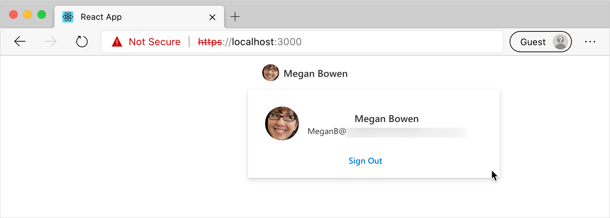

# <a name="use-the-microsoft-graph-toolkit-with-react"></a>将 Microsoft Graph 工具包与响应结合使用

Microsoft Graph 工具包是一组 web 组件，可简化与 Microsoft Graph 的连接，并使您可以将精力集中在您的应用程序上。 Microsoft Graph 工具包可用作通过 **@microsoft/mgt** npm 程序包分发的一组通用 web 组件。

如果您正在构建具有反应的应用程序，则可以使用 **@microsoft/mgt-react** 包，它会在响应组件中包装 Microsoft Graph 工具包 web 组件，从而更轻松地传递复杂数据。

本文介绍了使用 Microsoft Graph 工具包创建响应应用程序并将其连接到 Microsoft 365 的分步过程。 完成这些步骤后，你将看到一个响应应用，显示 Microsoft 365 中当前登录用户的即将到来的约会。

## <a name="prerequisites"></a>先决条件

若要按照本文中的步骤操作，你将需要 Microsoft 365 开发环境和一些工具。 有关详细信息， [请参阅入门](./overview.md)。

## <a name="create-a-react-app"></a>创建响应应用程序

通过运行以下命令创建新的响应应用程序。 这将使用 TypeScript 创建新的响应应用程序，这将帮助您编写更可靠的代码并避免运行时错误。

```cmd
npx create-react-app my-m365-app --template typescript
```

将工作目录更改为新创建的应用程序。

```cmd
cd my-m365-app
```

接下来，安装包含 Microsoft Graph 工具包响应组件 **的 npm 包** 。

```cmd
npm i @microsoft/mgt-react
```

确认您可以运行应用程序。

```cmd
HTTPS=true npm start
```

> [!IMPORTANT]
> 您的应用程序需要在 HTTPS 上运行，以便能够针对 Microsoft 365 进行身份验证。 对于本地测试，使用响应脚本，可以通过将环境变量设置为来将本地 web 服务器配置为在 HTTPS 上运行 `HTTPS` `true` 。 您可以每次执行此操作，为 `npm start` 命令加上前缀 `HTTPS=true` (仅在 bash) 或通过在您的计算机上全局设置环境变量。

您应该能够通过在浏览器中打开您的应用程序 `https://localhost:3000` 。

[!INCLUDE [AAD with implicit flow app registration](../includes/aad-app-registration-spa.md)]

## <a name="connect-react-app-to-microsoft-365"></a>将响应应用连接到 Microsoft 365

现在，您已将应用程序注册到 Azure Active Directory (Azure AD) ，可以将响应应用程序连接到 Microsoft 365。 首先，允许用户使用其 Microsoft 帐户登录应用。

### <a name="copy-the-azure-ad-application-registration-id"></a>复制 Azure AD 应用程序注册 ID

1. 在 Azure 门户中，转到应用程序注册。
1. 验证您是否在 " **概述** " 页上。
1. 从 " **Essentials** " 部分，将应用程序的值复制 **(客户端) ID** 属性

### <a name="configure-the-microsoft-graph-toolkit-authentication-provider"></a>配置 Microsoft Graph 工具包身份验证提供程序

接下来，配置 Microsoft Graph 工具包应使用的身份验证提供程序。 在这种情况下，您将使用 MSAL，这是构建独立应用程序的一个很棒的默认值。 如果使用 Microsoft 365 中的任一扩展点（如团队或 SharePoint），则将使用 [其他提供程序](../providers.md)。

1. 在代码编辑器中，打开 " **src/索引"。** 文件，并添加到导入列表中，请执行以下操作：

    ```tsx
    import { MsalProvider, Providers } from '@microsoft/mgt';
    ```

1. 在最后一个 `import` 语句后，使用 MSAL provider 初始化 Microsoft Graph 工具包。

    ```tsx
    Providers.globalProvider = new MsalProvider({
      clientId: 'REPLACE_WITH_CLIENTID'
    });
    ```

    将属性的值替换 `clientId` 为 `Application (client) ID` 先前在 Azure 门户中复制的属性的值。

进行这些更改后， **src/index 的 tsx** 文件将如下所示。

  ```tsx
  import { MsalProvider, Providers } from '@microsoft/mgt';
  import React from 'react';
  import ReactDOM from 'react-dom';
  import App from './App';
  import './index.css';
  import * as serviceWorker from './serviceWorker';
  
  Providers.globalProvider = new MsalProvider({
    clientId: 'REPLACE_WITH_CLIENTID'
  });
  
  ReactDOM.render(
    <React.StrictMode>
      <App />
    </React.StrictMode>,
    document.getElementById('root')
  );
  
  // If you want your app to work offline and load faster, you can change
  // unregister() to register() below. Note this comes with some pitfalls.
  // Learn more about service workers: https://bit.ly/CRA-PWA
  serviceWorker.unregister();
  ```

### <a name="add-the-sign-in-button"></a>添加 "登录" 按钮

添加 **登录名** Microsoft Graph 工具包响应组件，该组件将显示 " **登录** " 按钮。用户可以使用将其 Microsoft 帐户登录到您的应用程序。

1. 在代码编辑器中，打开 **src/App/tsx** 文件，并将导入到导入列表：

    ```tsx
    import { Login } from '@microsoft/mgt-react';
    ```

1. 在 `App` 函数中，将子句的内容替换 `return` 为基本结构，包括 Microsoft Graph 工具包登录组件：

    ```tsx
    <div className="App">
      <header>
        <Login />
      </header>
    </div>
    ```

在进行这些更改后， **src/App tsx** 文件将如下所示。
```tsx
import { MsalProvider, Providers } from '@microsoft/mgt';
import { Login } from '@microsoft/mgt-react';
import React from 'react';
import './App.css';

function App() {
  Providers.globalProvider = new MsalProvider({
    clientId: 'REPLACE_WITH_CLIENTID'
  });

  return (
    <div className="App">
      <header>
        <Login />
      </header>
    </div>
  );
}

export default App;
```

### <a name="test-signing-in-to-your-application"></a>测试登录到应用程序

你现在应该能够使用 Microsoft 帐户登录到应用程序。

1. 返回到正在运行响应应用程序的浏览器。 现在，你应该会看到 **"登录"** 按钮。
1. 当您单击 " **登录** " 按钮时，系统将提示您使用 Microsoft 帐户登录 (您可以使用与您在其中使用) 的 Azure 门户访问过的帐户相同的帐户。
1. 由于这是你第一次使用此 Azure AD 应用程序，因此你需要同意它在你的组织中的使用。
1. 登录后，你将被重定向到你的响应应用。 请注意，" **登录** " 按钮更改为显示您的用户的名称  。

## <a name="load-data-from-microsoft-365"></a>从 Microsoft 365 加载数据

Microsoft Graph 工具包不仅简化了对 Microsoft 365 的身份验证，还简化了其数据的下载。 在此示例中，您将显示 "已登录人员的日历"。

### <a name="specify-permissions-needed-for-your-application"></a>指定应用程序所需的权限

在可以从 Microsoft 365 加载数据之前，您需要指定您的应用程序访问用户数据必须授予的权限范围列表。 这些作用域因要显示的信息类型而异。 在这种情况下，你将需要访问人员的日历，以及对同时显示在日历中的人员的信息的基本访问权限。 可以在 [Microsoft GRAPH API 文档](/graph/api/overview?toc=.%2Fref%2Ftoc.json&view=graph-rest-1.0)中查找每个 API 所需的范围。

1. 在代码编辑器中，打开 " **src/索引" tsx** 文件，并更新提供程序初始化代码。

    ```tsx
    Providers.globalProvider = new MsalProvider({
      clientId: 'd7cb93c9-9097-4e38-8f06-7c0088ac3318',
      scopes: ['calendars.read', 'user.read', 'openid', 'profile', 'people.read', 'user.readbasic.all']
    });
    ```

### <a name="show-users-data-after-signing-in"></a>登录后显示用户数据

接下来，扩展应用程序以显示用户日历中的数据。 只有在用户登录后，才能访问此信息。 若要执行此操作，您需要跟踪用户的登录状态，并在用户使用其 Microsoft 帐户登录后显示日历数据。

#### <a name="track-users-sign-in-state"></a>跟踪用户的登录状态

若要在应用程序中跟踪用户的登录状态，您需要结合使用响应 `useState` 和 `useEffect` 挂接与提供程序事件处理程序。

1. 在代码编辑器中，打开 **src/App. tsx** 文件，并扩展现有的响应 `import` 语句。

    ```tsx
    import React, { useState, useEffect } from 'react';
    ```

1. `Provider` `ProviderState` 通过添加到导入，从 Microsoft Graph 工具包导入和类型。

    ```tsx
    import { Providers, ProviderState } from '@microsoft/mgt';
    ```

1. 添加一个名为的自定义函数 `useIsSignedIn` ，该函数可在应用程序中跟踪用户的登录状态。

    ```tsx
    function useIsSignedIn(): [boolean] {
      const [isSignedIn, setIsSignedIn] = useState(false);
    
      useEffect(() => {
        const updateState = () => {
          const provider = Providers.globalProvider;
          setIsSignedIn(provider && provider.state === ProviderState.SignedIn);
        };
    
        Providers.onProviderUpdated(updateState);
        updateState();
    
        return () => {
          Providers.removeProviderUpdatedListener(updateState);
        }
      }, []);
    
      return [isSignedIn];
    }
    ```

此函数执行两项操作。 首先，使用响应 `useState` 挂钩，启用组件内的跟踪状态。 每当状态更改时，响应将重新呈现你的组件。 其次，通过响应 `useEffect` 挂钩，它通过跟踪 Microsoft Graph 工具包提供程序中的更改并更新组件（如有必要）来扩展组件的生命周期。

#### <a name="load-users-calendar-if-user-is-signed-in"></a>如果用户已登录，则加载用户的日历

现在，您在应用程序中跟踪用户的登录状态，您可以在登录后显示其日历。

1. 在代码编辑器中，打开 **src/app.config** 文件，并在 **应用程序** 函数中添加：

    ```tsx
    const [isSignedIn] = useIsSignedIn();
    ```

    这将定义一个布尔 `isSignedIn` 常量，可使用该常量来确定用户当前是否登录到您的应用程序。

1. `return`使用附加 `div` 的和 Microsoft Graph 工具包的 "议程" 组件扩展子句的内容。

    ```tsx
    <div>
      {isSignedIn &&
        <Agenda />}
    </div>
    ```

使用这些更改时， **src/App tsx** 文件应如下所示：

```tsx
import { Providers, ProviderState } from '@microsoft/mgt';
import { Agenda, Login } from '@microsoft/mgt-react';
import React, { useState, useEffect } from 'react';
import './App.css';

function useIsSignedIn(): [boolean] {
  const [isSignedIn, setIsSignedIn] = useState(false);

  useEffect(() => {
    const updateState = () => {
      const provider = Providers.globalProvider;
      setIsSignedIn(provider && provider.state === ProviderState.SignedIn);
    };

    Providers.onProviderUpdated(updateState);
    updateState();

    return () => {
      Providers.removeProviderUpdatedListener(updateState);
    }
  }, []);

  return [isSignedIn];
}

function App() {
  const [isSignedIn] = useIsSignedIn();

  return (
    <div className="App">
      <header>
        <Login />
      </header>
      <div>
        {isSignedIn &&
          <Agenda />}
      </div>
    </div>
  );
}

export default App;
```

### <a name="test-showing-users-calendar-after-they-signed-in"></a>在用户登录后显示用户日历的测试

使用这些更改，在使用 Microsoft 帐户登录应用程序后，您应该会看到您的日历。

1. 若要查看所做的更改，请关闭浏览器并重新打开它，然后转到 `https://localhost:3000` 。 执行此操作的原因是您更改了属性的值 `scopes` ，这将影响您从 AZURE AD 请求的访问令牌。
1. 选择 " **登录** " 按钮，并使用你的 Microsoft 帐户登录。 请注意，在同意提示中所请求的权限列表中添加的内容。 这是因为您在该属性中包含了其他权限 `scope` 。
1. 在同意使用应用程序后，您应看到有关当前用户及其日历的信息。


## <a name="next-steps"></a>后续步骤

- 请参阅 [Microsoft Graph 工具包中的内容](../overview.md)。
- 尝试 [样本](https://mgt.dev)中的组件。
- 在 [堆栈溢出](https://aka.ms/mgt-question)时提出问题。
- 在 [GitHub](https://aka.ms/mgt)上报告错误或保留功能请求。
